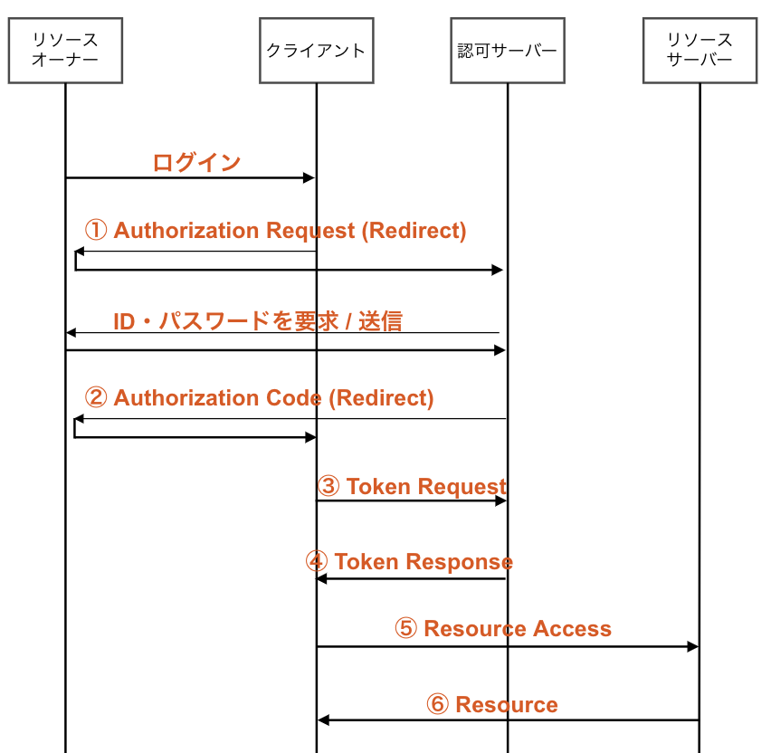

# OpenID Connect

## OpenID Connect とは？

- OAuth のフローの拡張したもの
- クライアント側で行っていた認証処理を OpenID Provider に任せることができる
- その結果、認証の結果を JWT でクライアントが受け取って認証をすることできる

## そもそも OpenID とは？

OpenID とは認証を特定のサービスごとに依存させないで連携するためのプロトコル。

このプロトコルを使えば、複数のサービスで共通の ID、パスワードを使うことができる。

メリットとして、ユーザーはパスワード管理の手間が減る、サービス側は認証情報を管理せずに済むなどがある。

デメリットは ID、パスワードが漏洩した場合は不正利用されるサービスが増えるといったことがある。

現実世界に例えると、免許証やマイナンバーカードみたいなもので、それを提示するだけで本人であることを証明できるもの。

上のような考え方をネットの世界に持ち込んだかんじ。

## OpenID Connect による認証の流れ



### ① Authorization Request (Redirect)

```
GET {認可エンドポイント}
  ?response_type=code            // codeは認可コードフロー, tokenならばインプリシットフロー
  &client_id={クライアントID}      // 必須
  &redirect_uri={リダイレクトURI}  // 条件により必須
  &scope=openid                  // openidはスコープ群に必須
  &state={任意文字列}              // CSRF対策、セッションに紐付けて保存
  HTTP/1.1
HOST: {認可サーバー}
```

### ② Authorization Code (Redirect)

```
HTTP/1.1 302 Found
Location: {リダイレクトURI}
  ?code={認可コード}        // Authorization Code(認可コード)がクエリに付与されて返却
  &state={任意文字列}       // セッションに紐づけておいたstateと比較、値が違う場合は処理を中断
```

### ③ Token Request

```
POST {トークンエンドポイント} HTTP/1.1 //Secretや認可コードを扱うのでPOSTメソッド
Host: {認可サーバー}
Content-Type: application/x-www-form-urlencoded

grant_type=authorization_code   // 必須
&code={認可コード}                // 取得した認可コードを指定
```

### ④ Token Response

```
HTTP/1.1 200 OK
Content-Type: application/json // JSON形式
Cache-Control: no-store
Pragma: no-cache

{
  "access_token":"{アクセストークン}",       // 必須
  "token_type":"Bearer",                   // アクセストークンはBearer形式、 Authorization: Bearer{アクセストークン}
  "expires_in":{有効秒数},                  // 任意
  "refresh_token":"{リフレッシュトークン}",   // 任意
  "id_token":"{IDトークン}"                 // ID Token(認証用トークン)を取得、シグネチャとデコードして各パラメータと検証
}
```

### ⑤ Resource Access

```
GET / HTTP/1.1
Host: {認可サーバー}
Authorization: Bearer{アクセストークン}
```

### ⑥ Resource

```
HTTP/1.1 200 OK
Content-Type: application/json // JSON形式

{
  "sub":"{ユーザー識別子}",
  //以下、ユーザー情報とかEmailアドレスとか
}
```

## 参考文献

- [OpenID Connect 入門 〜コンシューマーにおける ID 連携のトレンド〜](https://www.slideshare.net/kura_lab/openid-connect-id)

- [OAuth 2.0 全フローの図解と動画](https://qiita.com/TakahikoKawasaki/items/200951e5b5929f840a1f#21-%E8%AA%8D%E5%8F%AF%E3%82%A8%E3%83%B3%E3%83%89%E3%83%9D%E3%82%A4%E3%83%B3%E3%83%88%E3%81%B8%E3%81%AE%E3%83%AA%E3%82%AF%E3%82%A8%E3%82%B9%E3%83%88)

- [多分わかりやすい OpenID Connect](https://tech-lab.sios.jp/archives/8651)

- [OpenID Connect についてと OAuth2.0 との違いを調べてみた](https://zenn.dev/mryhryki/articles/2021-01-30-openid-connect)

- [RFC OpenID Connect 1.0(3.1~)](http://openid-foundation-japan.github.io/openid-connect-core-1_0.ja.html#TokenRequest)
