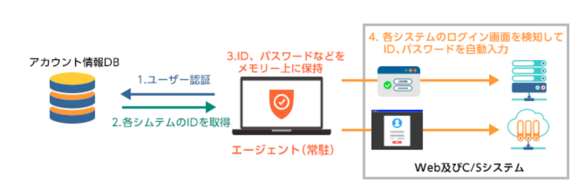
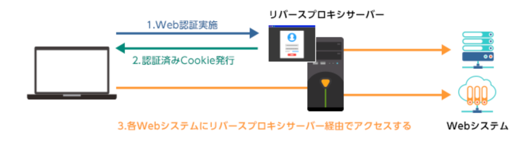
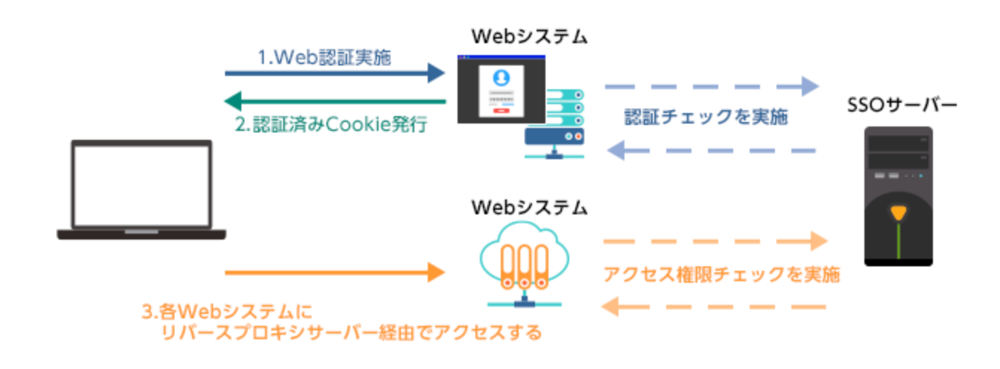
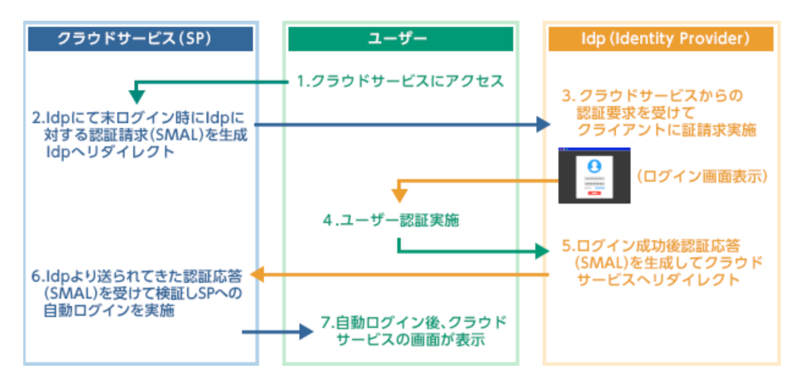

# SSO
## SSOとは
SSOは**Single Sign-on**の略。
「シングル」と「サインオン」を合わせた造語で、**一度シムテムのユーザー認証を行うと複数のシステムの利用を開始する際に都度認証を行う必要がない仕組み**を持つツールを意味する。

## SSOのメリット
SSOは以下の問題を解決することができる。
- サービス毎のログイン作業による業務効率の低下
- 複数のサービスで同じパスワードを使い回すことによるセキュリティの問題
- (企業の場合)従業員のパスワード関連の問題への対応

## SSOのデメリット
- SSOのID・パスワードが漏洩するとSSOで扱うサービス全てが不正利用される可能性がある
- SSOのシステムが停止すると、扱うサービス全てにログインできなくなる

## SSOの仕組み
SSOには4つの仕組みがある。
### 代行認証方式
クライアントのパソコンにインストールした専用のエージェントがユーザーの代理でID・パスワードを打ち込む方式。

### リーバスプロキシ方式
リバースプロキシと言われるサーバー上で認証を行う方式。
リバースプロキシ上で認証を追加したああいに、その後ろにあるサービスにログインできるようになる
。

### エージェント方式
Webサービスの専用のエージェントモジュールを組み込んで、シングルサインオンを実現する方式。
エージェントはシングルサインオン用の外部サーバーと連携し、認証やアクセス権限のチェックを行う。

### SAML認証方式
SAML（Security Assertion Markup Language）認証では、IdP（Identity Provider）とSP（Service Provider）と呼ばれる2つの構成要素で、シングルサインオンを実現する方式。
以下のような流れで利用される。

- ユーザーが対象のWebサービス（SP）へアクセスすると、SPはIdPへ認証要求（SAML）を送信する。
-  IdPがユーザーのパソコンやスマートフォンに専用のログイン画面を表示させ、認証を促す。
- 認証が成功すれば、IdPはSPに対して認証応答（SAML）を送信し、SPがそれを受け取ると自動ログインを実行する。

これによって1度認証が成功すれば、SAMLに対応する別サービスへ自動でログインできるようになる。

また、SAML方式のみ異なるドメインで運営されているサービス同士でのSSOを実現できる点などから特に注目されている方式である。

## 参考文献

トラスト・ログイン |  シングルサインオン（SSO）とは
(最終閲覧日：2021 年 3 月 28 日）
https://trustlogin.com/sso/

カゴヤのサーバー研究室 |  シングルサインオン（SSO）とは？メリットと仕組みを解説
(最終閲覧日：2021 年 3 月 28 日）
https://www.kagoya.jp/howto/network/single-sign-on/
