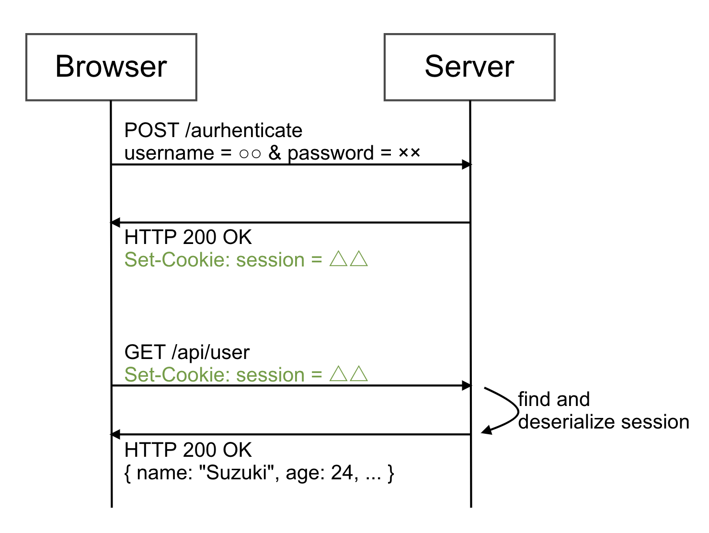

# cookie認証
## cookieとは
cookieとはWebサーバーがクライアントに預けておく極小ファイルのこと。
クライアントがWebサーバーに初めて接続した際にWebサーバーがクライアントにCookieを送信する。

次にクライアントがWebサーバー接続した時には、WebブラウザがそのcookieをWebサーバーに送信する。

cookieにはクレデンシャル情報、ショッピングサイトなどの買い物かごの情報などに使われる。

## cookieの基本
- WebサーバーからWebブラウザへHTTPレスポンスのヘッダを利用して小さな情報を送る。
- この情報は「名前=値」の組み合わせで表される。
- Webアプリケーション側では、リクエストヘッダに入っているCookieを調べることで、アクセスしてきた相手がどのような相手なのかを知ることができる。
- Cookieは、サーバアクセスするたびに自動送信される。
- Cookieを受け取ったあとでも、Cookieを受け取ったサーバとは異なるWebサーバに対してはCookieを送らない。(意図しない情報がほかのWebサーバーに送られるのを防ぐ)

## 認証でなぜcookieを使うのか
- HTTPはステートレスなプロトコルで状態を持てない。
- しかし、ログインなどはリクエストをまたいで状態を持つ必要がある。
- Cookieを使えばHTTPでも状態を持つことができ、認証機能を実現することができる。

## cookie認証のフロー

## 参考文献

RFC | RFC2965
(最終閲覧日：2021 年 3 月 25 日）
https://www.ietf.org/rfc/rfc2965.txt

Qiita | JWT・Cookieそれぞれの認証方式のメリデメ比較
(最終閲覧日：2021 年 3 月 25 日）
https://qiita.com/doyaaaaaken/items/02357c2ebca994160804

Qiita | 認証トークンをCookieに保存するのは卒業しよう
(最終閲覧日：2021 年 3 月 25 日）
https://qiita.com/hirohero/items/d74bc04e16e6d05d2a4a

Carpe Diem | JWTを認証用トークンに使う時に調べたこと
(最終閲覧日：2021 年 3 月 25 日）
https://christina04.hatenablog.com/entry/2016/06/07/123000
