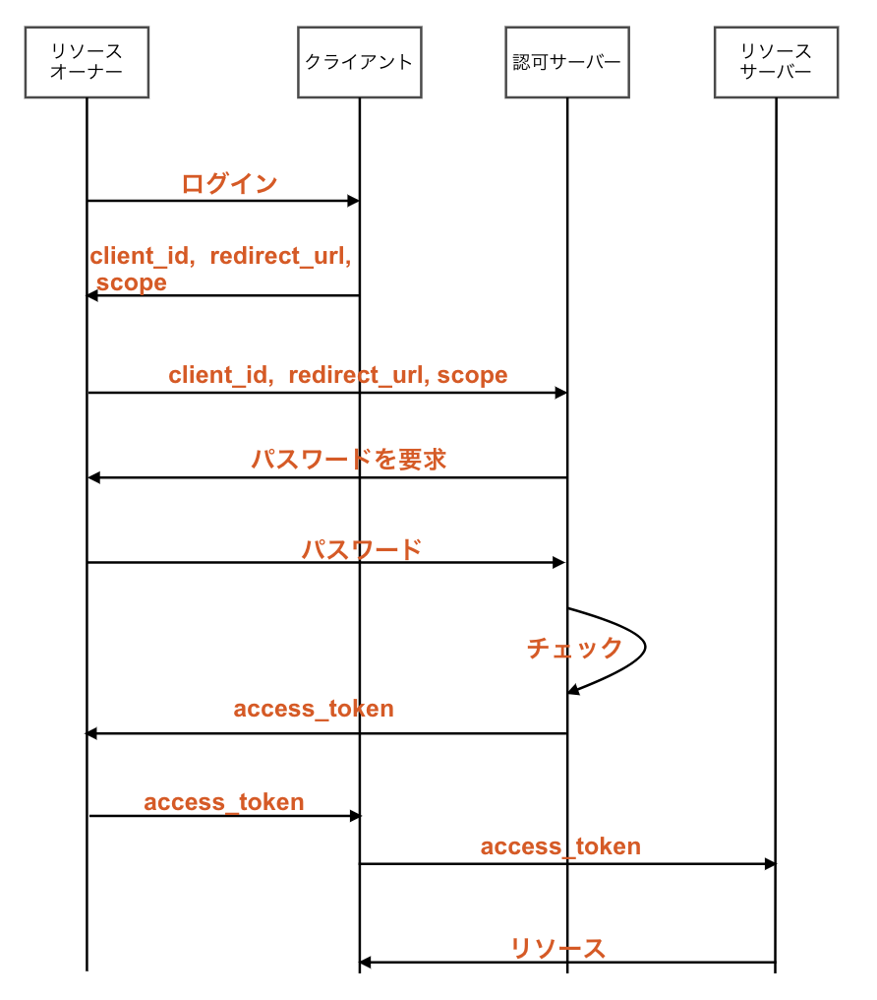
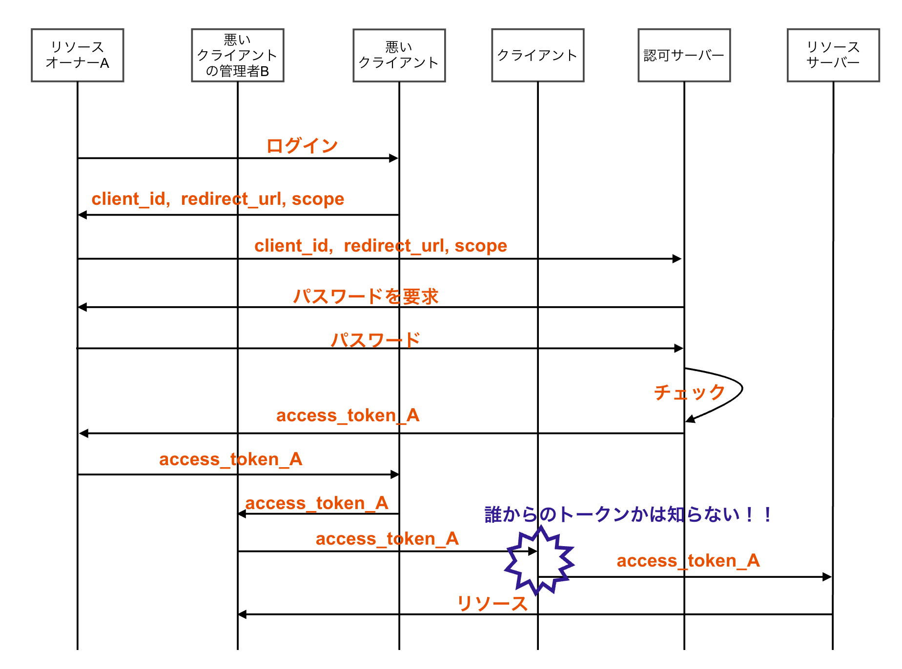

# OAuth

## OAuth とは

OAuth とは SNS や Web サービス間で**アクセス権限の認可を行うためのプロトコル**。
現在は 2012 年に[RFC6749](https://tools.ietf.org/html/rfc6749)として発行された OAuth2.0 が標準化されている。

重要なことなので、もう一度言うと、**OAuth は認可を行うためのプロトコル。**

決して、**認証を行うためのプロトコルではない。**

## OAuth の仕組みの概要

OAuth2.0 では複数の登場人物（サーバー）が連携して認可を行う。
と言うことで、最初に登場人物について簡単に説明する。

### リソースオーナー(User Agent)

OAuth2.0 を使ってアカウントを連携したいエンドユーザー。
保護対象のリソースを所有しているユーザーでもある。

### クライアント

保護対象のリソースにアクセスしたいソフトとかアプリのこと。

### 認可サーバー

リソースオーナーに対して認証を行い、リソースサーバーに対するアクセストークンを発行するサーバー。

立場上、リソースサーバーに信頼されているサーバーの必要があり、OAuth で最も重要な役割と言っても過言ではない。

### リソースサーバー

保護対象のリソースを保持しているサーバーのこと。
例えば Instagram の投稿画像とかそういうものを持っているサーバー。

### 認可のフロー

- client_id : クライアントがリソースオーナーに代わって、リソースサーバーにアクセスするための一時的に発行される id
- redirect_url : クライアントアプリーケーションに認可レスポンスを渡すためのリダイレクト URL
- scope : リソースへのアクセス権の範囲を制限するためのトークン

このフローから以下のような OAuth の特徴が分かる。

- クライアントに対してリソースサーバーへのパスワードを渡すことなく、リソースを取得することができる
- scope を決めれるので、クライアントにリソースに対する全権限を渡さなくて済む

## OAuth を認証に使っちゃうとどうなるのか？

上記で認可のフローを示したが、これを見ると認可だけでなくて認証もいけそうな気がするが、それはしてはいけない。

上記のフローでクライアントが「悪いサイト」だった場合は以下のようなフローでトークンすり替え攻撃ができる。

上のフローでは B さんが A さんのアクセストークンでクライアントにアクセスして、A さんのリソースを手に入れてしまっている。

クライアントは誰からトークンを渡されたかチェックしてないので、A さんのトークンを渡されたら A さんのリソースを返す。
このように OAuth ではトークンさえあれば誰かは関係なく、リソースを渡してしまう。

これは例えるなら**宛先を書かずに合鍵を渡して、鍵さえ持っていれば誰かは確認せずに家に入っていいよ**っていう感じ。

とは言ってもこれは OAuth は悪くない。
あくまで**OAuth は認可のためプロトコル**だからである。

## 対策について

対策方法は主に２つある。

１つはアクセストークンの発行元を検証すること。
上記の問題はクライアントがアクセストークンを確認せずになんでも受け入れているため発生している。
なので、クライアントはユーザーにトークンを発行されるときに、発行されたアクセストークンがどのクライアント向けなのかを記録しておく。
こうしておけば、アクセストークンが渡されたときにそのアクセストークンが他のクライアント向けに発行されたものだった場合はクライアントで拒否することができる。

もう１つは OpenID Connect を使うこと。
これが一番確実な方法らしい。

## OAuth の認証フロー

### Authorization Code

認可サーバーから短命の認可コードを発行し、認可サーバーにて発行した認可コードと引き換えでアクセストークンを発行するフロー。

サーバーサイド処理を行う web アプリケーション向け。

### Implicit

Authorization Code と似ているが、認可サーバーから直接アクセストークンを受け取るフロー。

ネイティブアプリ、JS アプリ向け。

### Resource Owner Password Credentials

クライアントに連携したいサービスの ID, Password を渡して、トークンリクエストを認可サーバーに投げるフロー。

クライアントに ID, Password が渡ってしまうため、あまり使われない。

### Client Credentials

クライアントの認証のみで、アクセストークンを発行するフロー。

ユーザー単位で認可を行わないアプリ向け。

### Refresh Token

リフレッシュトークンを認可サーバーに提示し、アクセストークンの再発行を受けるフロー。

アクセストークンが発行される際にリフレッシュトークンの発行もされていることが前提。

<!-- ## OAuth の使い所

## まとめ -->

## 参考文献

- [OAuth2.0 の流れをまとめてみる](https://zenn.dev/mryhryki/articles/2020-12-28-oauth2-flow)
- [OAuth 2.0 の代表的な利用パターンを仕様から理解しよう](https://www.buildinsider.net/enterprise/openid/oauth20)
- [OAuth 2.0 認可コードフロー+PKCE をシーケンス図で理解する](https://zenn.dev/zaki_yama/articles/oauth2-authorization-code-grant-and-pkce)
- [OAuth 2.0 全フローの図解と動画](https://qiita.com/TakahikoKawasaki/items/200951e5b5929f840a1f#%E3%81%8A%E3%81%BE%E3%81%91)
- [セキュリティトークンと OAuth 2.0](https://www.ipa.go.jp/security/awareness/vendor/programmingv2/contents/709.html)
- [最適な OAuth 2.0 フローの選び方](https://kb.authlete.com/ja/s/oauth-and-openid-connect/a/how-to-choose-the-appropriate-oauth-2-flow)
- [単なる OAuth 2.0 を認証に使うと、車が通れるほどのどでかいセキュリティー・ホールができる](https://www.sakimura.org/2012/02/1487/)
- [「単なる OAUTH 2.0 を認証に使うと、車が通れるほどのどでかいセキュリティー・ホールができる」について](https://tech-lab.sios.jp/archives/13002)
- [PKCE: 認可コード横取り攻撃対策のために OAuth サーバーとクライアントが実装すべきこと](https://qiita.com/TakahikoKawasaki/items/00f333c72ed96c4da659)
- [OAuth 2.0 の認可レスポンスとリダイレクトに関する説明](https://qiita.com/TakahikoKawasaki/items/8567c80528da43c7e844)
