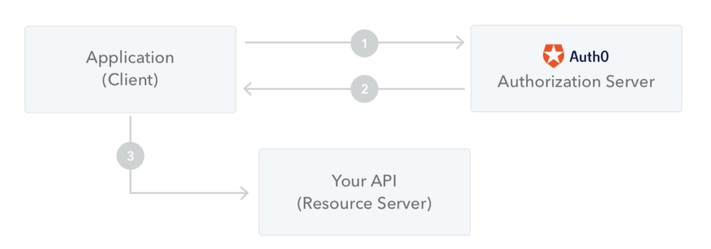

# トークン認証

## トークンとは

Web の認証の分野でトークンとはアクセストークンをさすことが多い。
アクセストークンが何かについて、[RFC6749 section 1.4. Access Token](https://tools.ietf.org/html/rfc6749#section-1.4)の訳を以下に示す。

```
アクセストークンはリソースをアクセスから保護するために使われるクレデンシャルです。
アクセストークンはクライアントに発行された承認を表す文字列です。
文字列は大抵はクライアントに不透明です。

トークンはリソースのオーナーによって付与され、リソースサーバーと認証サーバーによって強制された特定の範囲とアクセスの期間を表します。
トークンは認証情報を取得するための識別子を示すものであっても良いし、もしくは認証情報を検証可能な方法で自己保持するものであってもよいです(例：トークン文字列はいくつかのデータと１つの署名から成る)。

クライアントがトークンを使用するためには、この仕様書の範囲外である追加の認証クレデンシャルが必要となる場合があります。

アクセストークンは抽象化されたレイヤーを提供し、異なる認証構造(例：ユーザーネームやパスワード)をリソースサーバが理解できる単一のトークンに置き換えます。
この抽象化により、アクセストークンを取得する際に使用された認可付与よりも制限されたアクセストークンを発行することが可能になり、リソースサーバーは広範囲の認証方法を理解する必要がなくなります。
アクセストークンはリソースサーバーのセキュリティ要件に基づいた異なるフォーマット、構造、暗号プロバティの利用メソッドを持つことができます。

アクセストークン属性と保護されたリソースにアクセスするためのメソッドはこの仕様の範囲外であり、[RFC6750]などの関連仕様で定義されています。
```

要約すると、アクセストークンは以下の特徴を持つ

- クレデンシャル情報
- クライアントには見えない文字列
- リソースにアクセスする権限の範囲と期間に制限がある
- Basic認証などの異なる認証構造を単一のトークンに置き換えている

## JWTとは
JWTとは**JSON Web Token**の略で[RFC7519](https://tools.ietf.org/html/rfc7519)に定義されているオープンスタンダードな技術。

特徴は以下の通り。

- 情報をJSONオブジェクトとして扱う
- 情報はデジタル署名されているので、検証と信頼ができる
- 公開鍵と秘密鍵のペアを使用して署名できる

## JWTの使い所
### 承認
ユーザーがログインすると後続のリクエストにはJWTが含まれ、ユーザーはこのトークンで許可されているリソースにアクセスできるようになる。

また、オーバーヘッドが小さく、様々なドメインで簡単に使用できるためSSOで広く使用されている。


### 情報交換
当事者間で情報を安全送信したい時に使う。
JWTは公開鍵と秘密鍵を使って署名ができるため送信者が本人であることが保証できる。
さらに署名はヘッダーとペイロードを使って計算されるため、コンテンツが改ざんされていないことも保証できる。

## JWTの構造
JWTはドット(.)で区切られた以下の3要素で構成されている。

- ヘッダ
- ペイロード
- 署名

なので、JWTは通常は以下の形の文字列になっている。

`xxxx.yyyy.zzzz`

次にそれぞれの要素の説明をしていく。

### ヘッダ
ヘッダーは通常、JWTのトークンと署名アルゴリズムの２要素で構成されている。
例えば以下のような感じ。

```
{
  "alg": "HS256",
  "typ": "JWT"
}
```
このJSONはBase64Urlでエンコードされ、JWTのヘッダ要素を形成する。

### ペイロード
JWTのトークンの２番目の要素で、クレームが含まれる。
クレームはエンティティと追加データに関するステートメントのこと。
クレームには、登録済み、パブリック、プライベートの３タイプがある。

登録済みクレーム：必須ではないが、推奨されるクレーム。
 iss（発行者）、 exp（有効期限）、 sub（件名）、 aud（聴衆）などがある。

 パブリッククレーム：JWTを使用するユーザーが次週に定義できるクレーム。
 衝突を回避するために、 [IANA JSON Web Token Registry](https://www.iana.org/assignments/jwt/jwt.xhtml)で定義するか、衝突耐性のある名前空間を含むURIとして定義する必要がある。

 プライベートクレーム：登録済み、パブリッククレームではないが、当事者間で情報を共有されるために作成されたカスタムクレーム。

 ペイロードの例は以下の通り。

 ```
 {
  "sub": "1234567890",
  "name": "John Doe",
  "admin": true
}
```

このJSONはBase64Urlでエンコードされ、JWTのペイロード要素を形成する。

### 署名
署名部分を作成するには、エンコードされたヘッダー、ペイロード、シークレット、ヘッダーで指定されたアルゴリズムを取得し、それに署名する必要がある。

例えば、HMAC SHA256アルゴリズムを使用する場合、署名は以下の方法で作成される。

```
HMACSHA256(
  base64UrlEncode(header) + "." +
  base64UrlEncode(payload),
  secret)
```

## JWTの使い方
ユーザーが保護されたリソースにアクセスするには常に、JWTを送信する必要がある。
通常はBearerスキーマを使用して、Authorizationヘッダーで送信する。
ヘッダーの内容は以下のようになる。

`Authorization: Bearer <token>`

以下の図はJWTを取得して、APIまたはリソースにアクセスするために使用する方法を示している。



1. アプリケーションまたはクライアントは、許可サーバーに許可を要求する。これは、さまざまな許可フローの1つを介して実行される。たとえば、一般的なOpenID Connect準拠のWebアプリケーションは/oauth/authorize、認証コードフローを使用してエンドポイントを通過する。
2. 承認が付与されると、承認サーバーはアクセストークンをアプリケーションに返す。
3. アプリケーションは、アクセストークンを使用して、保護されたリソース（APIなど）にアクセスする。

<!-- ## 補足
### デジタル署名
### 公開鍵と秘密鍵
### オーバーヘッド
### ヘッダーとペイロード -->

## 参考文献

JWT | Introduction to JSON Web Tokens
(最終閲覧日：2021 年 3 月 22 日）
https://jwt.io/introduction

Qiita | 【JWT】 入門
(最終閲覧日：2021 年 3 月 22 日）
https://qiita.com/Naoto9282/items/8427918564400968bd2b#%E8%AA%8D%E8%A8%BC%E3%81%AB%E3%81%8A%E3%81%91%E3%82%8Bjwt%E3%81%AE%E5%88%A9%E7%94%A8
