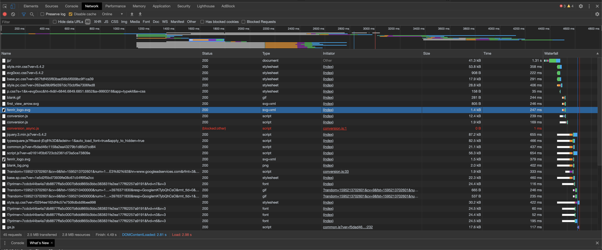
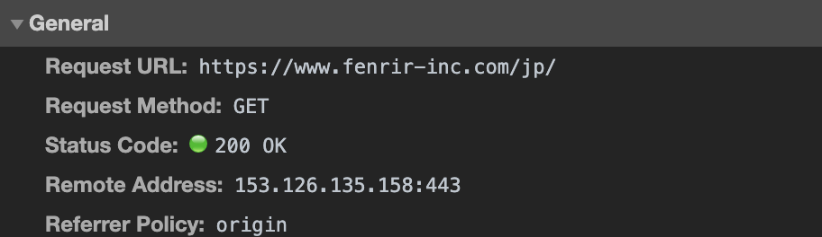
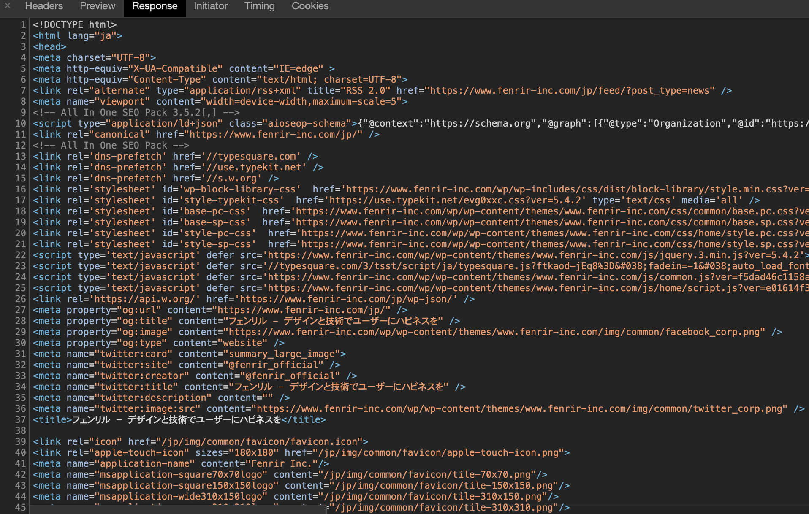
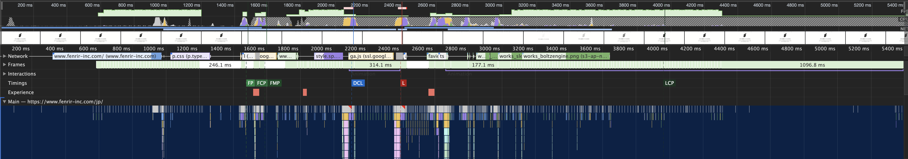
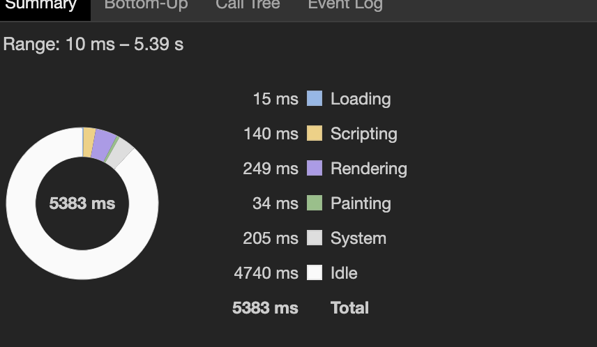

# What is HTTP? - HTTPって何?
## HTTPとは？
HTTPとはWWWの世界でHTMLをやり取りするためのプロトコルのこと。**Hyper Text Transfer Protocol**の略。

## HTTP通信の仕組み
HTTP通信は以下の(1) ~ (3)の流れで通信が行われる。

（1）クライアントからサーバーに「リクエスト（要請）」を送る

（2）サーバーが必要な処理を行う

（3）サーバーからクライアントに「レスポンス（返答）」を返す

ちなみに、HTTPでは1回のやりとりで処理できる情報は1つに限られる。
そのため、複数の情報を処理したいときは、この動作を必要な回繰り返す。

## HTTPリクエストの中身
リクエストは大きく三つの部分に分類でき、それぞれ、「リクエスト行」「ヘッダーフィールド」「メッセージ本体」と呼ばれる。

- リクエスト行：「情報を取り出したいのか」「情報を送りたいのか」などのサーバに送るリクエストの種類を指定する部分
- ヘッダーフィールド：サーバー名、ブラウザーの種類、接続維持の指定などリクエストに関連する各種の補足的な情報を指定する部分
- メッセージ本体：主に「情報を送る」リクエストのときに、送りたい情報を格納する部分

リクエスト行はメソッド、ターゲット、HTTPバージョンを含んでいる。
メソッドには以下のようなものがある。

|メソッド|意味|
|--|--|
|GET|サーバ上のファイルを取り出す|
|HEAD|GETメソッドでリクエストした時に返されるヘッダーを要求する|
|POST|サーバ上にデータを送付する|
|PUT|サーバ上のファイルを書き換える|
|DELETE|サーバ上のファイルを削除する|
|CONNECT|中継のための接続を作る|
|OPTIONS|対象の利用できるメソッドの一覧を読み出す|
|TRACE|リクエストをそのまま送り返す|

## HTTPレスポンスの中身
レスポンスの中身はリクエストとよく似ていて、大きく「ステータス行」「ヘッダーフィールド」「メッセージ本体」の３つがある。

ステータス行は、HTTPバージョン、ステータスコード、理由フレーズで構成されている。
ステータスコードは以下のように分類される。

|コード|分類|意味|
|--|--|--|
|1xx|情報系|リクエストを受信して、その処理を継続中|
|2xx|成功系|リクエストの処理に成功|
|3xx|リダイレクト系|リクエストを終えるにはさらに処理が必要|
|4xx|クライアントエラー系|リクエストの構文に問題がある、もしくは実行できない|
|5xx|サーバエラー系|リクエストの構文は正常だが、サーバが実行できない|

よく使うステータスコードを以下にピックアップする。

|コード|意味|
|--|--|
|200|正常|
|301|URLが変わったよ|
|302|一時的なURLの変更、サイトのメンテナンスなどで、一時的に別ページに飛ばす時などに使用される|
|400|不正なリクエスト|
|403|指定したURLを使う権限がない|
|404|見つからない、存在しないURLに対してアクセスしようとしているときに帰ってくる|
|500|サーバ内部エラー、コード内にsyntax errorがあった場合など|
|503|サーバが使えない、サーバがメンテナンス中や大量アクセスなどで使用できないときに返ってくる|


## ヘッダフィールドについて
ヘッダフィールドはフィールド名と値で構成されている。

リクエスト、レスポンスでよく使われるヘッダーフィールドは以下のようなものがある。

|フィールド名|意味|
|--|--|
|Host|唯一必須のヘッダで、宛先サーバ名を意味する|
|User-Agent|ブラウザやクライアントプログラムの名称やバージョン|
|Referer|参照元のURI|
|Accept-Encoding|受理可能なエンコーディング|
|Accept-Language|受理可能な言語|
|Content-Encoding|内容のエンコーディング|
|Content-Language|内容の言語|
|Last-Modified|内容の最終更新日|
|ETag|内容を要約する情報(この変化から更新が分かる)|
|Connection|接続状態に関する通知(リクエスト処理後は即座に切断など)|

## 実際のHTTPリクエストの中身
<!-- 実際に自分で実行 -->
(GET通信の場合）
```
GET　/www.yoheim.net/?key1=value1&key2=value2 HTTP/1.1
Accept:text/html,application/xhtml+xml,application/xml;q=0.9,*/*;q=0.8
Accept-Charset:Shift_JIS,utf-8;q=0.7,*;q=0.3
Accept-Encoding:gzip,deflate,sdch
Accept-Language:ja,en-US;q=0.8,en;q=0.6
Cache-Control:max-age=0
Connection:keep-alive
Cookie:utma=something;
Host:www.yoheim.net
User-Agent:Mozilla/5.0 (Macintosh; Intel Mac OS X 10_7_4) AppleWebKit/536.5 (KHTML, like Gecko) Chrome/19.0.1084.54 Safari/536.5
```

（POST通信の場合）
```
POST /www.yoheim.net/ HTTP/1.1
Host: localhost:8080
User-Agent: Mozilla/5.0 (Macintosh; Intel Mac OS X 10_7_4) AppleWebKit/536.5 (KHTML, like Gecko) Chrome/19.0.1084.54 Safari/536.5
Accept: text/xml,application/xml,application/xhtml+xml,text/html;q=0.9,text/plain;q=0.8,image/png,*/*;q=0.5
Accept-Language: ja,en-us;q=0.7,en;q=0.3
Accept-Encoding: gzip,deflate
Accept-Charset: Shift_JIS,utf-8;q=0.7,*;q=0.7
Keep-Alive: 300
Connection: keep-alive
Content-Type: text/plain
Content-Length: 23

key1=value1&key2=value2
```

## 実際のHTTPレスポンスの中身
```
※HTTP/1.1要求の送信例
GET / HTTP/1.1 ……サイトのトップページデータの取得
HOST: www.microsoft.com ……HTTP/1.1を使う場合はhost:ヘッダを指定すること

※HTTP/1.1応答の例
HTTP/1.1 200 OK ……1行目はHTTP応答
Server: Apache ……2行目以下はHTTP応答ヘッダフィールド
ETag: "6082151bd56ea922e1357f5896a90d0a:1425454794"
Last-Modified: Wed, 04 Mar 2015 07:39:54 GMT
Accept-Ranges: bytes
Content-Length: 1020
Content-Type: text/html
Date: Mon, 27 Mar 2017 07:07:14 GMT
Connection: keep-alive
……空行（ヘッダと本文の境界）
<html> ……以下、HTTP応答本文。HTML形式のテキストが返ってきている
<head>
<title>Microsoft Corporation</title>
<meta http-equiv="X-UA-Compatible" content="IE=EmulateIE7"></meta>
<meta http-equiv="Content-Type" content="text/html; charset=utf-8"></meta>
<meta name="SearchTitle" content="Microsoft.com" scheme=""></meta>
……（以下省略）……

```

<!-- 開発者ツールでのレスポンスの見方を調べる -->

## Google Chromeデベロッパーツールでレスポンスを見てみる
 Google Chromeデベロッパーツールで[フェンリル株式会社のHP](https://www.fenrir-inc.com/jp/)のHTTPレスポンスを覗いてみる。

 HP上で **Cmd+Opt+I** もしくは **右クリック->「検証」** をして、Networkタブを選択。
ちなみに「Disable cache」にチェックを入れるとデベロッパーツールを開いている間のみキャッシュが無効化される。

Networkタブを開いた状態で、ページをリロードすると以下の画像のように通信内容が表示される。

 

ちなみに表示された1行がhttp通信1回分になる。

一番上の「jp/」はこのページのHTMLの取得のための通信で、
以降の行にはこのページを表示するために必要な画像やCSS、JavaScriptファイルを取得するための通信になる。

通信の詳細を見るために「jp/」をクリックする。

HeadersタブのGeneralの欄にあるRequest URLはブラウザがWebサーバーに対して依頼したWebサイトのURLのこと。

Status Codeという項目が上記で説明したステータスコードのこと。

今回は「200 OK」となっているので正常に取得できていることを表す。

 

Responseタブを選択すると、実際にHTMLが取得できていることがわかる。

 

ついでにページのパフォーマンスを見てみる。

Performanceタブの一番上グラフはWebサイトにアクセスしてから表示完了となるまでを時系列で表す。

 

グラフは範囲指定可能で、指定した範囲のパフォーマンスを確認することもできる。

全範囲にした状態で一番下のSummaryタブを選択すると円グラフが表示される。
この円グラフはページ表示にかかった時間の内訳を表しており、Totalはページ表示にかかったトータルの時間を表す。

 

今回はトータルで5383 msだったのでページ表示に6秒弱かかっていることが分かる。

## 参考文献
３分間ネットワーキング　（最終閲覧日：2020年7月20日）

http://www5e.biglobe.ne.jp/aji/3min/index.html

IT media Inc. - 「HTTP」の仕組みをおさらいしよう　（最終閲覧日：2020年7月20日）

https://www.atmarkit.co.jp/ait/articles/1507/31/news004.html

SEO研究所サクラサクラボ - 「Google Chromeデベロッパーツールとは？使い方や簡易的な解析テクニックについてご紹介します！　（最終閲覧日：2020年7月20日）

https://www.sakurasaku-labo.jp/blogs/developer-tools#%E3%83%9A%E3%83%BC%E3%82%B8%E4%B8%8A%E3%81%AE%E3%82%A8%E3%83%A9%E3%83%BC%E3%83%81%E3%82%A7%E3%83%83%E3%82%AF
