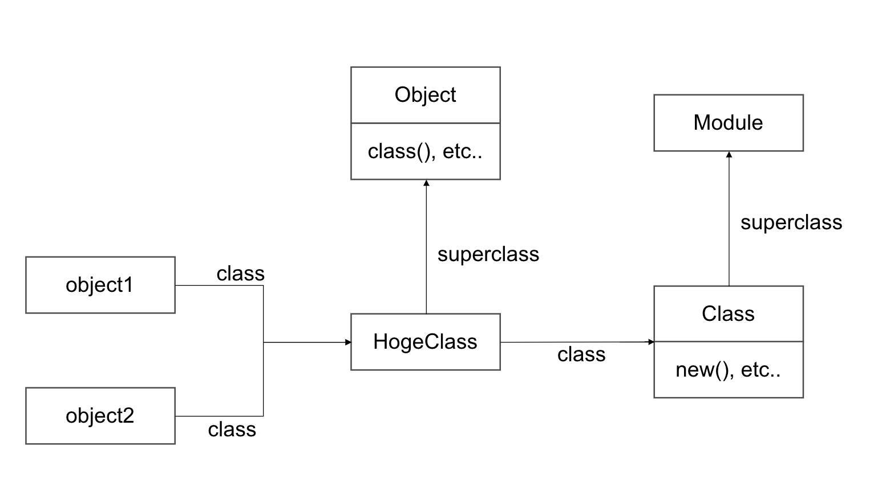

# オブジェクトモデル

## オープンクラス

### クラス定義の内部

Ruby は既存のクラス(標準クラスを含む)を再オープンして修正できる。

この技法をオープンクラスと呼ぶ。

```
my_object = String.new('hello, world!')

p my_object
# => "hello, world!"

p my_object.to_alphanumeric
# => ain.rb:8:in `<main>': undefined method `to_alphanumeric' for "hello, world!":String (NoMethodError)
# to_alphanumericなんてメソッドは無いよ！って怒られる

# オープンクラスでStringクラスを拡張してto_alphanumericメソッドを新たに追加

class String
  # 文字列の句読点や特殊文字を取り除くメソッドを追加
  def to_alphanumeric
    gsub(/[^\w\s]/, '')
  end
end

p my_object.to_alphanumeric
# => "hello world"
```

オープンクラスはライブラリでよく使われる手法(らしい)。

### オープンクラスの問題点

オープンクラスは便利だが、既存のメソッドを上書きしてしまう危険がある。

こうした危険性があるため、オープンクラスをモンキーパッチと蔑称で呼ぶ人もいるらしい。

※ 必ずしもモンキーパッチという名詞に侮蔑的な意味が込められているわけでは無いっぽい。

## オブジェクトモデルの内部

### オブジェクトの中身

#### インスタンス変数

ruby は Java などの静的言語とは違い、オブジェクトのクラスとインスタンス変数に繋がりがない。

そのため以下のように同じクラスのオブジェクトでもインスタンス変数の数が異なる場合がある。

```
class MyClass
  def my_method
    @v = 1
  end
end

object = MyClass.new

p object.class # => MyClass
p object.instance_variables # =>[]
# このタイミングではインスタンス変数 v は存在しない

object.my_method

p object.class # => MyClass
p object.instance_variables # => [:@v]
# my_methodメソッドが呼ばれることで初めてインスタンス変数 v が生成される
```

#### メソッド

また、上の例から「object は my_method メソッドを持っている」と言える。

ただし、「MyClass は my_method メソッドを持っている」は間違いである。

これだと MyClass.my_method が呼べることになってしまう。

このような曖昧さを回避するために my_method は MyClass のインスタンスメソッドと呼ばれる。

同じメソッドでも

クラスに着目している場合はインスタンスメソッド

オブジェクトに着目している場合はメソッド

と呼ぶ。

```
String.instance_methods == "abc".methods # => true

String.methods == "abc".methods # => false
```

まとめると、以下の図のような感じ。


### クラスの真相

Ruby のオブジェクトモデルを学ぶときに重要なのは「クラスもオブジェクト」であるということ。

ということはオブジェクトに当てはまるということはクラスにも当てはまる。

```
'hello'.class
# => String
# 'hello'はStringクラスに属するオブジェクト

String.class
# => Class
# StringはClassクラスに属するオブジェクト
```

当たり前だが、オブジェクトはメソッドを持つ。

ここで思い出したいのは「オブジェクトのメソッドはそのクラスのインスタンスメソッド」ということ。

ということは「クラスのメソッドは Class クラスのインスタンスメソッド」ということになる。

ということで Class クラスのインスタンスメソッドを見てみる。

```
Class.instance_methods(false)
# => [:new, :allocate, :superclass]
# 引数のfalseは継承したメソッドは無視してねという意味

# 余談
c = Class.new
c.methods == Class.instance_methods
# => true
# クラスのメソッドはClassクラスのインスタンスメソッドは正しいと証明できた(はず)
```

ここで３つのインスタンスメソッドが出てくるが、重要なのは`:superclass`。

`:superclass`はなんのクラスを継承しているかを調べるためのメソッド。

ここで、String クラスはなんのクラスを継承しているか辿ってみる。

```
String.superclass
# => Object

Object.superclass
# => BasicObject

BasicObject.superclass
# => nil
```

よって BasicObject は Ruby のクラス階層のルートということが分かる。

#### モジュール

Class クラスがなんのクラスを継承しているか確認する。

```
Class.superclass # => Module
```

このことから Class クラスは Module クラスを継承していることが分かる。

つまり、全てのクラスはモジュールということになる。

※正確に言うと、クラスは new, allocate, superclass の３つのインスタンスメソッドを追加したモジュール。

ここまでをまとめると以下のようになる。

```
class HogeClass; end

object1 = HogeClass.new
object2 = HogeClass.new
```



### 定数

大文字で始まる参照はクラス名やモジュール名を含めて全て定数である。

Ruby の仕様では定数は変数とよく似ていて、インタプリタで警告は出るが定数の値は変更することができる。

定数と変数の違いはスコープにある。

```
module HogeModule
  HogeContent = '外側の定数'

  class HogeClass
    HogeContent = '内側の定数'
  end
end

# HogeModule
#  |
#   -- HogeClass
#  |    |
#  |     -- HogeContent
#   -- HogeContent
#
# 2つのHpgeContentは違う定数
```

プログラムにある定数はファイルシステムみたいなもので、ディレクトリが違えば同じファイル名を持てる。

モジュールがディレクトリで、定数がファイル。

また、ファイルと同じようにパスを使って定数を参照することができる。

#### 定数のパス

定数のパスはコロン２つで区切れば良い。
絶対パスで指定する場合はコロン２つで書き始めればいい。

```
Y = 'hoge'

module M
  Y = 'huga'
  class C
    X = 'fiz'
  end
  C::X # => 'fiz'
  Y # => 'huga'
  ::Y # => 'hoge'
end

M::C::X # => 'fiz'

```

### オブジェクトとクラスのまとめ

- オブジェクトとはインスタンス変数の集まりにクラスへのリンクがついたもの
- オブジェクトのメソッドはオブジェクトのクラスの生き物
- オブジェクトのメソッドはクラスのインスタンスメソッド
- クラスはオブジェクト(Class クラスのインスタンス)にインスタンスメソッドの一覧と親クラス(スーパークラス)へのリンクがついたもの
- Class クラスは Module クラスの子クラス(サブクラス)

## メソッドを呼び出すとき何が起きているのか？

### メソッド探索

レシーバーとはメソッドの呼び出し元のオブジェクトのこと。

継承チェーンとはあるオブジェクトのスーパークラスを辿っていった道筋のこと。

メソッド探索とは「Ruby がレシーバーに入って、メソッドを見つけるまで、継承チェーンをたどる」こと。

クラスの継承チェーンは ancestors メソッドで確認できる。

```
String.ancestors # => [String, Comparable, Object, Kernel, BasicObject]
```

一つ疑問なのが、継承チェーンに Kernel がある。

Kernel はクラスではなくてモジュールである。

#### モジュールとメソッド探索

継承チェーンにはモジュールも含まれている。

モジュールをクラスにインクルードすると、そのクラスの上に入る。

```
module M
  def hoge_method
    'M#hoge_method()'
  end
end

class C
  include M
end

class D < C; end

D.ancestors
# => [D, C, M, Object, Kernel, BasicObject]
```

Ruby2.0 から prepend メソッドというクラスの継承チェーンにモジュールを挿入する方法が追加された。

prepend メソッドは include と違い、モジュールをインクルードしたクラスの下に挿入する。

```
module M2
  def hoge_method
    'M#hoge_method()'
  end
end

class C2
  prepend M2
end

class D2 < C2; end

D2.ancestors
# => [D2, M2, C2, Object, Kernel, BasicObject]
```
