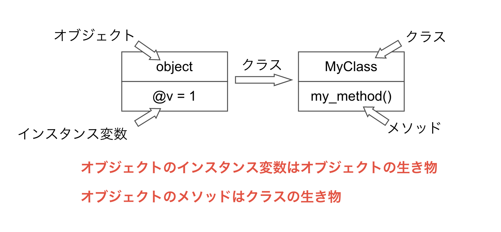

# オブジェクトモデル

## オープンクラス

### クラス定義の内部

Ruby は既存のクラス(標準クラスを含む)を再オープンして修正できる。

この技法をオープンクラスと呼ぶ。

```
my_object = String.new('hello, world!')

p my_object
# => "hello, world!"

p my_object.to_alphanumeric
# => ain.rb:8:in `<main>': undefined method `to_alphanumeric' for "hello, world!":String (NoMethodError)
# to_alphanumericなんてメソッドは無いよ！って怒られる

# オープンクラスでStringクラスを拡張してto_alphanumericメソッドを新たに追加

class String
    # 文字列の句読点や特殊文字を取り除くメソッドを追加
    def to_alphanumeric
        gsub(/[^\w\s]/, '')
    end
end

p my_object.to_alphanumeric
# => "hello world"
```

オープンクラスはライブラリでよく使われる手法(らしい)。

### オープンクラスの問題点

オープンクラスは便利だが、既存のメソッドを上書きしてしまう危険がある。

こうした危険性があるため、オープンクラスをモンキーパッチと蔑称で呼ぶ人もいるらしい。

※ 必ずしもモンキーパッチという名詞に侮蔑的な意味が込められているわけでは無いっぽい。

## オブジェクトモデルの内部

### オブジェクトの中身

ruby は Java などの静的言語とは違い、オブジェクトのクラスとインスタンス変数に繋がりがない。

そのため以下のように同じクラスのオブジェクトでもインスタンス変数の数が異なる場合がある。

```
class MyClass
    def my_method
        @v = 1
    end
end

object = MyClass.new

p object.class # => MyClass
p object.instance_variables # =>[]
# このタイミングではインスタンス変数 v は存在しない

object.my_method

p object.class # => MyClass
p object.instance_variables # => [:@v]
# my_methodメソッドが呼ばれることで初めてインスタンス変数 v が生成される
```

また、上の例から「object は my_method メソッドを持っている」と言える。

ただし、「MyClass は my_method メソッドを持っている」は間違いである。

これだと MyClass.my_method が呼べることになってしまう。

このような曖昧さを回避するために my_method は MyClass のインスタンスメソッドと呼ばれる。

同じメソッドでも

クラスに着目している場合はインスタンスメソッド

オブジェクトに着目している場合はメソッド

と呼ぶ。

```
String.instance_methods == "abc".methods # => true

String.methods == "abc".methods # => false
```

まとめると、以下の図のような感じ。


