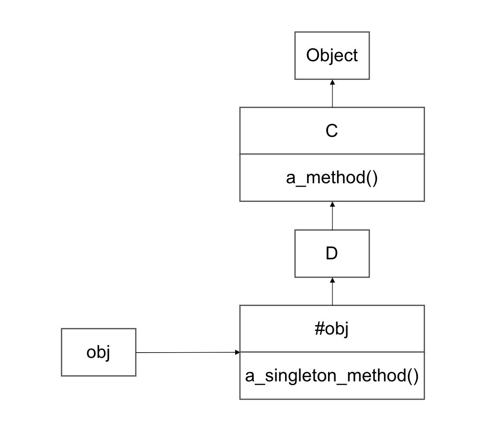
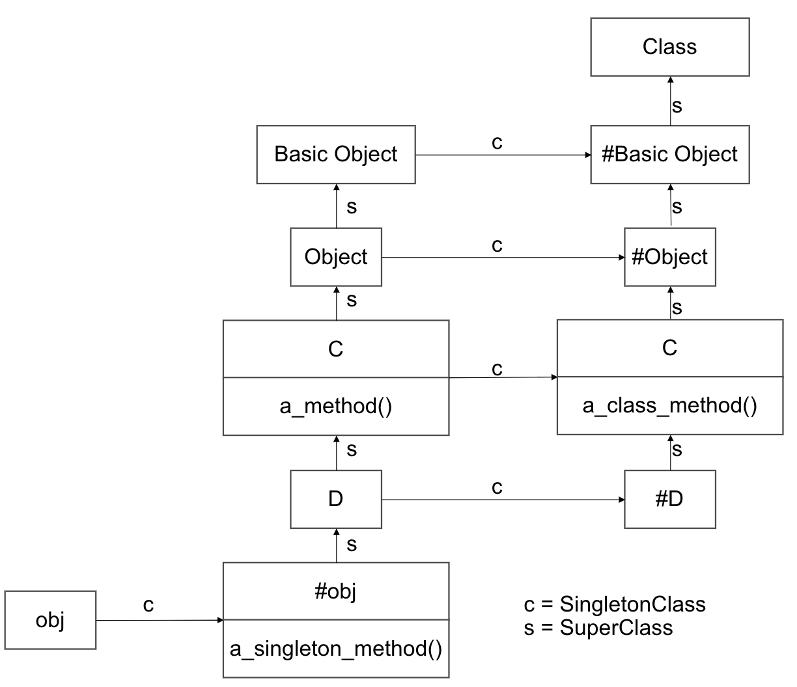

# クラス定義

## クラス定義の中身

クラス定義にはメソッド以外のあらゆるコードを書くことができる。

```Ruby
class HelloClass
 p 'hello'
end

# => "hello"
```

また、メソッドやブロックと同じように最後の命令文の値を戻す。

```Ruby
result = class HogeClass
 a = 10
 b = 20
end

p result # => 20
```

## カレントクラス

Ruby はカレントオブジェクト self を持っている。
それと同様にカレントクラスを持っている。

カレントクラスの追跡のルールは以下の通り。

- プログラムのトップレベルでは main のクラスの Object になる。

```Ruby
p self # => main
p self.class # => Object
```

- class キーワードでクラス(あるいは module キーワードでモジュール)をオープンすると、そのクラスがカレントクラスになる

- メソッドの中では、カレントオブジェクトのクラスがカレントクラスになる

### class_eval

class_eval はクラスのコンテキストでブロックを評価できる。

```Ruby
def add_method_to(klass)
  klass.class_eval do
    def greet
      p 'Hello!'
    end
  end
end

add_method_to(String)

'abc'.greet # => "Hello!"
```

こんな感じで、オープンクラスみたく、クラスをブロックで開くことができる。

また、class_eval は self とカレントクラスを変更することができる。

```Ruby
class HogeClass
  def initialize
    @v = 1
  end
end

object = HogeClass.new

object.instance_eval do
  p self # => #<HogeClass:0x00000000015cddb0 @v=1>
  p @v # => 1
end

HogeClass.class_eval do
  def initialize
    @v = 2
  end

  def hoge
    p 'hoge'
  end
end

# 書き換え前に作られたオブジェクトにもhogeメソッドは使える。
object.hoge # => "hoge"

# 書き換え前に作られたオブジェクトのselfは上書きされない。
object.instance_eval do
  p self # => #<HogeClass:0x00000000015cddb0 @v=1>
  p @v # => 1
end

object2 = HogeClass.new

# 書き換え後に作られたオブジェクトのselfは上書きされている。
object2.instance_eval do
  p self #<HogeClass:0x0000000001b64558 @v=2>
  p @v # => 2
end
```

## クラスインスタンス変数

以下の例ではクラスのインスタンス変数とクラスのオブジェクトのインスタンス変数は別物であることを示している。

```Ruby
class MyClass
  @v = 1
  def self.read; p @v; end
  def write; @v = 2; end
  def read; p @v; end
end

obj = MyClass.new
obj.read # => nil
obj.write
obj.read # => 2
MyClass.read # => 1
```

上のコードでは 2 つの@v が異なるスコープで定義されている。

クラスもオブジェクトであることと self がスコープによってどのような振る舞いをするのかを思い出すと理解しやすい。

write メソッドで定義されている@v は obj が self となるため、obj のインスタンス変数である。

MyClass 直下に定義されている@v は MyClass が self となるため、MyClass というオブジェクトのインスタンス変数となる。

このようなインスタンス変数をクラスインスタンス変数と呼ぶ。

## 特異メソッドの導入

Ruby では特定のオブジェクトにメソッドを追加できる。

```Ruby
str = "jast a regular string"

p str.methods.grep(/title?/) # => []

def str.title?
  self.upcase == self
end

p str.title? # => false

p str.methods.grep(/title?/) # => [:title?]
p 'aaa'.methods.grep(/title?/) # => []

# singleton_methodsはそのオブジェクトに定義されている特異メソッドの一覧を返すメソッド
p str.singleton_methods # => [:title?]
```

上記のコードは文字列 str に title?メソッドを追加している。
String クラスの他のオブジェクトには影響がない。

このように単一のオブジェクトに特化したメソッドを特異メソッドと呼ぶ。

特異メソッドは上記の方法か、Object#define_singleton_method で定義できる。

## クラスメソッドはクラスの特異メソッド

いきなりの復習になるが、クラスは単なるオブジェクトであり、クラス名は単なる定数である。

このことが分かれば、クラスメソッドの呼び出しと、インスタンスメソッドの呼び出しは同じものであることが分かる。

```Ruby
an_object.a_method
AClass.a_class_method
```

1 行目は変数で参照したオブジェクトのメソッドを呼び出している。

2 行目は定数で参照したオブジェクトのメソッドを呼び出している。

ここで思い出したいのはクラスメソッドの定義の方法である。

特異メソッドとクラスメソッドの定義の仕方を比較してみると、この 2 つは同じものであることが分かる。

```Ruby
def obj.a_singleton_method; end
def MyClass.another_class_method; end
```

つまり、特異メソッドを def を使って定義する構文は常に以下のようになる。

```Ruby
def object.method
  #  メソッドの中身
end
```

上記の object の部分には以下の 3 つが使える。

- オブジェクトの参照
- クラス名の定数
- self

## 特異クラス

Ruby には普段見ているクラス以外に特異クラスと呼ばれる特別なクラスがある。

特異クラスは普段は隠れていて見れないが、特異クラスのスコープに入れる特別な構文がある。

```Ruby
obj = String.new

class << obj
  p self # => #<Class:#<String:0x00000000013c6620>>
end

p 'abc'.singleton_class # => #<Class:#<String:0x0000000001c126d0>>
```

特異クラスの特徴は以下の通り。

- Object#singleton_class か class << を使わないと見れない
- インスタンスを一つしか持てない
- 特異クラスはオブジェクトの特異メソッドが住んでいる場所

## 特異クラスとメソッド探索

特異クラスは画面に印字すると以下のように#がついて表示される。

```Ruby
obj = Object.new

p obj.class # => Object
p obj.singleton_class # => #<Class:#<Object:0x0000000002162748>>
```

これから先のルールとして、特異クラスを表すときは#のプレフィックスを使う。

例えば#obj は obj の特異クラスといった感じ。

以下に特異クラスとメソッド探索をするためのサンプルプログラムを示す。

```Ruby
class C
  def a_method
    p 'C#a_method()'
  end
end

class D < C; end

obj = D.new

class << obj
  def a_singleton_method
    p 'obj#a_singleton_method()'
  end
end
```

上の例では特異クラス #obj を作成した。
特異クラスもクラスであるため、スーパークラスがあるはずであるなので#obj のスーパークラスを見てみる。

```Ruby
p obj.singleton_class.superclass # => D
```

<!-- ```plantuml
@startuml
title 特異メソッドの探索
namespace 特異メソッドの探索 {
  class #obj {
    + a_singleton_method()
  }

  class D {}


  }
}
@enduml
``` -->

これらの情報を図にすると以下のようになる。



特異メソッドも通常のメソッドのように探索することができることが分かった。
オブジェクトが特異メソッドを持っていれば特異クラスから探索を始める。

## 特異クラスと継承

先程のプログラムの例の class C にクラスメソッドを追加する。

```Ruby
class C
 class << self
   def a_class_method
     p 'C.a_class_method()'
   end
 end

 def a_method
   p 'C#a_method()'
 end
end
```

オブジェクトモデルを見ていく。

```Ruby
p C.singleton_class # => #<Class:C>
p D.singleton_class # => #<Class:D>

p C.singleton_class.superclass # => #<Class:Object>
p D.singleton_class.superclass # => #<Class:C>
```

上のコードのように継承を遡っていくと以下の図のようになる。



ぱっと見複雑だが、このようにオブジェクトモデルを配置することでサブクラスからクラスメソッドを呼び出すことができる。

```Ruby
D.a_class_method # => "C.a_class_method()"
```

このように a_class_method()が C で定義されていても、D から呼び出すことができる。

これは#D のメソッド探索がスーパークラス#C に上がって、そこでメソッドを見つけたからである。
