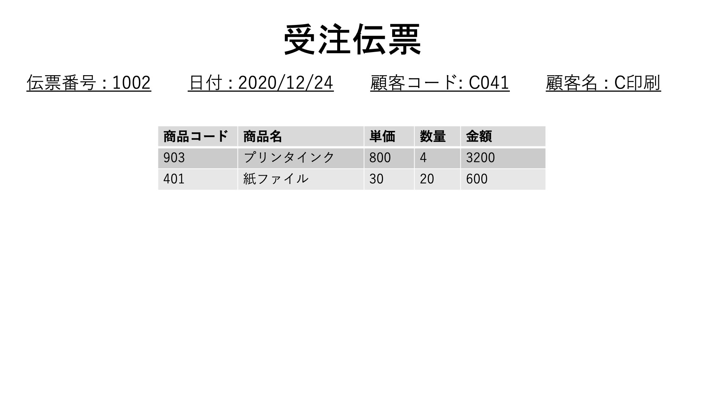
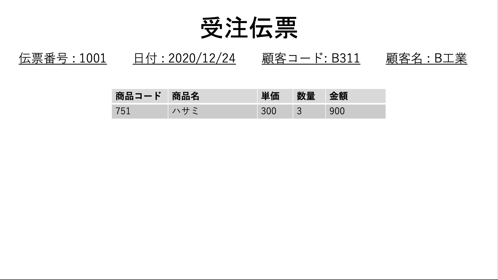
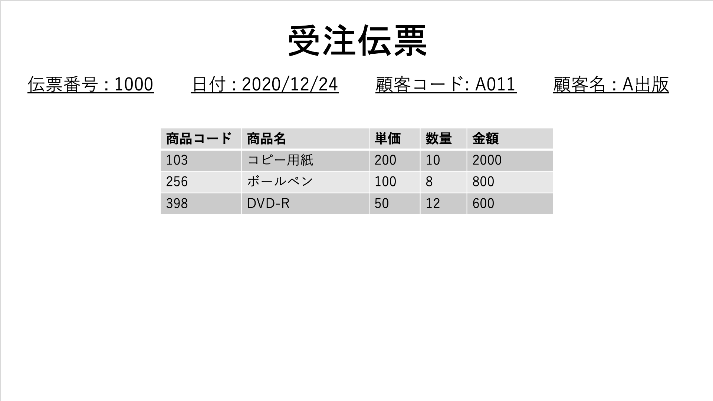
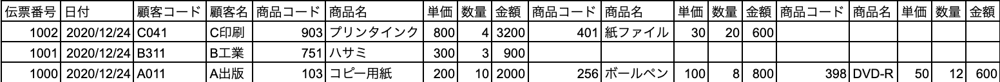
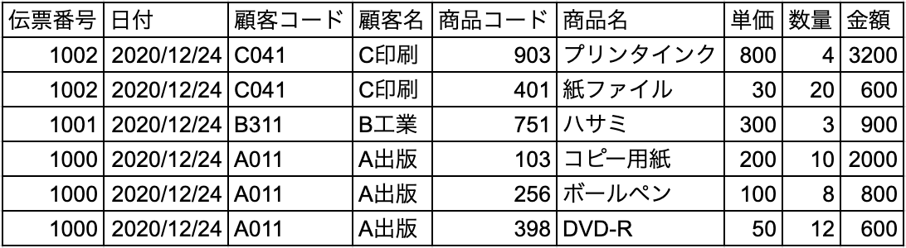

# 正規化

## 正規化とは

正規化はテーブル内のデータに矛盾や重複を生じさせないために行われる。

正規化は、

非正規形 → 第 1 正規形 → 第 2 正規形 → 第 3 正規形

という段階に別れている。

(本当は第３正規形より高次の正規化もあるが、ここでは扱わない)

## 非正規形

非正規形とは、正規化されていない繰り返し部分を持つ表のこと。

例えば以下のような伝票があるとして、

この伝票１枚１枚が１件のレコードとして並べると以下のようになる。

見ての通り、繰り返しになっている部分があり、各レコードの長さがバラバラになっている。

これだと、リレーショナルデータベースとして管理しにくい。

## 第 1 正規形

第１正規化をすると、繰り返しの部分を分離して、素直な２次元の表の形に直すことができる。

非正規化から第１正規化の手順は

1. 繰り返し部分を切り離す
2. 切り離したデータを加工して独立したレコードにする
3. 独立させたレコードを挿入する

これを上記の例で再現すると、以下のようになる。

## 関数従属と部分関数従属

<!-- 関数従属とは主キーに対して一意に決まっている列の値 -->

## 第 2 正規形

## 第 3 正規形
