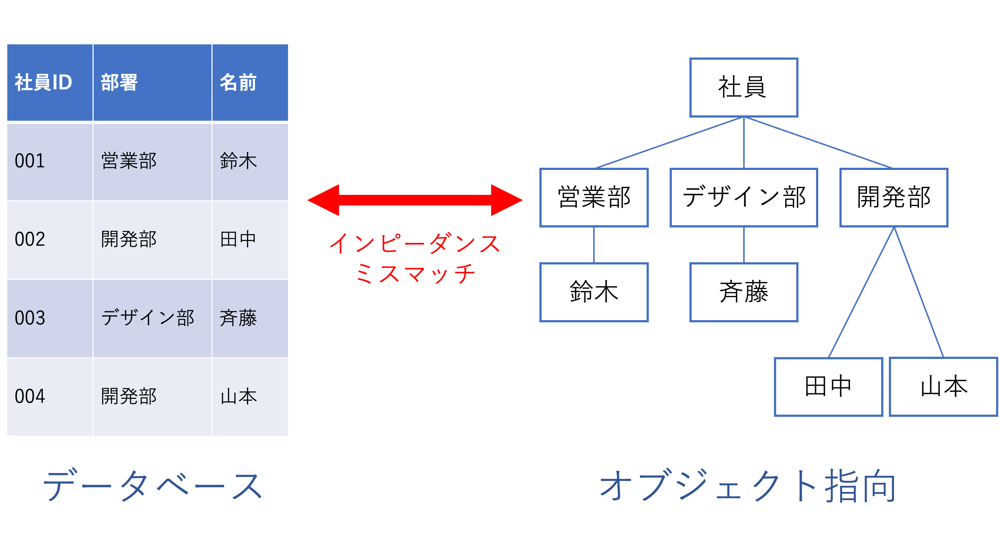

# ORMs

## ORM とは

オブジェクト関係マッピング(Object-relational mapping、O/RM、ORM)のこと。

以下、[Wikipedia](https://ja.wikipedia.org/wiki/%E3%82%AA%E3%83%96%E3%82%B8%E3%82%A7%E3%82%AF%E3%83%88%E9%96%A2%E4%BF%82%E3%83%9E%E3%83%83%E3%83%94%E3%83%B3%E3%82%B0)より引用。

> データベースとオブジェクト指向プログラミング言語の間の非互換なデータを変換するプログラミング技法である。
> オブジェクト関連マッピングとも呼ぶ。実際には、オブジェクト指向言語から使える「仮想」オブジェクトデータベースを構築する手法である。
> オブジェクト関係マッピングを行うソフトウェアパッケージは商用のものもフリーなものもあるが、場合によっては独自に開発することもある。

分かりにくいけど、自分なりに噛み砕くと、データをオブジェクトとして扱ってオブジェクト指向プログラミング言語との間を繋いでくれる技法のこと。

SQL を書かなくてもデータベースからデータを引っ張って来れるので、SQL より直感的に書けるようになる。

## ORM のメリット

- バインド変数など、セキュリティ対策の施された SQL を生成してくれる
- 似た SQL を何回も記述しなくても良い (データモデルを 1 か所に記述するだけで良い)
- テーブル間の所有関係を定義することができる
- DBMS の違いを吸収できる
- インピーダンスミスマッチを解消してくれる

## ORM のデメリット

- SQL をそのまま書くより自由度が下がる

## インピーダンスミスマッチ

データベースでデータを扱う考え方とオブジェクト指向でデータを扱う考え方が違うのに、その間でデータを扱おうとしても無理が出ちゃうよねって感じの話。

もう少し詳しく書くと、データベースは表の形で正規化を用いて、データの CRUD 操作に最適なモデルを定義している。

一方、オブジェクト指向では現実世界のモデルに即した物をデータモデルとして定義している。

このモデルの設計思想の違いを**インピーダンスミスマッチ**という。

図にすると ↓ のような感じ。

## ORM の例

## 参考文献

Qiita | オブジェクト関係マッピング(最終閲覧日：2020 年 12 月 4 日）
https://qiita.com/yk-nakamura/items/acd071f16cda844579b9

Qiita | もっと ORM を使えるようになりたいので、見直してみた(最終閲覧日：2020 年 12 月 4 日）
https://qiita.com/niisan-tokyo/items/156eb35c6eeaf07b9b65

Think IT | 第１回：O/R マッピングとは？(最終閲覧日：2020 年 12 月 4 日）
https://thinkit.co.jp/cert/article/0606/13/1/2.htm

達人プログラマーを目指して | O/R マッピングで緩和されるインピーダンスミスマッチには静的と動的の側面がある(最終閲覧日：2020 年 12 月 4 日）
https://ryoasai.hatenadiary.org/entry/20110501/1304252041
