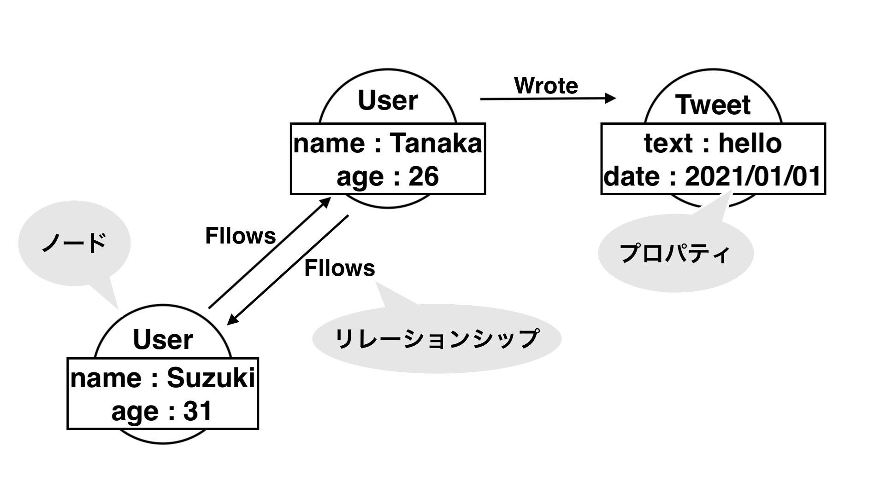
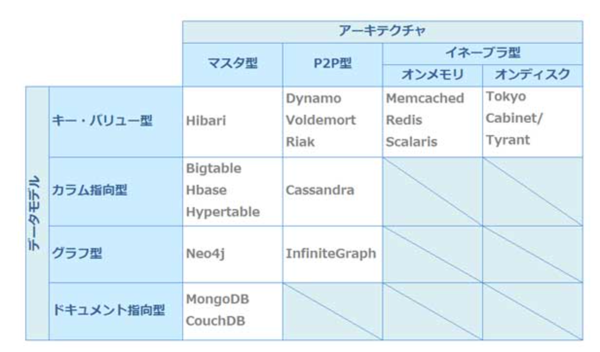

# NoSQL について

## NoSQL とは

NoSQL とは RDBMS とは違い、データ操作に SQL を使わないでデータ操作ができるデータベースの総称のこと。

RDBMS 違いとして以下のような特徴がある。

- スキーマレス
- リレーションを持たない
- トランザクションがない
- スケールアウトがしやすい

## NoSQL の必要性

RDB では現代の以下の様な問題に対応するのが難しくなっている。

1. データ量の増加

   - Google は 2007 年時点で 20 ペタバイト(20000 テラバイト)/日を処理しているらしい…

2. 処理速度の増加

   - twitter は 120 万/秒のつぶやきを処理しているらしい(2010 時点)

3. 多様性の増加
   - 半構造データは RDB で格納するのは難しい

上記を解決する DB として NoSQL は生まれた。

例えば、1,2 はキー・バリュー型、ドキュメント型のデータベースで解決しやすい。

3 はグラフデータベースなどに向いている。

## NoSQL の種類

NoSQL の分類方法は以下の２つに着目して分けることができる。

- どのような形でデータを持つか(データモデル)
- どのように分散してデータを持つか(アーキテクチャ)

## データモデルによる分類

### キー・バリュー型

キー・バリュー型とは、その名前の通り、キーとバリューの組み合わせだけで表現できる。
例えば以下のような感じ。

| key  | value        |
| ---- | ------------ |
| car1 | Century      |
| car2 | CROWN        |
| car3 | PRIUS        |
| car4 | COROLLA      |
| car5 | LAND CRUISER |

キー・バリュー型は以下の様なメリット・デメリットがある。

- メリット
  - データモデルがシンプル
  - スケールアウトに適した構造
  - 高速でデータの読み書きが可能(メモリ上にデータを保存)
  - 分散処理に適している
- デメリット
  - トランザクション処理できないものが多い
  - テーブルを結合させるような複雑な処理は苦手

### カラム指向型

カラム指向型は RDB の様に表の構造を持っているが、カラム単位でデータを保持してる。

カラム指向型は以下の様なメリット・デメリットがある。

- メリット
  - 少ない列を対象にした参照、集計が高速
  - 任意の列だけの値の更新が高速
  - スケールアウトが容易
- デメリット
  - レコード単位での挿入、削除、更新は遅い
  - トランザクション処理が苦手

### グラフ型

グラフ型はデータ構造がネットワーク状になっている DB である。

グラフ型はノード、リレーションシップ、プロパティによって構成される。

グラフ型のメリットは繋がりのあるデータ検索などが非常に早いことである。

一方でデータ全体から統計情報を分析することは苦手で、データ構造に繋がりがない場合はグラフ型を導入するメリットは薄い。

### ドキュメント指向型

ドキュメント指向型は JSON や XML の書式で書かれたデータを保存する DB。

ドキュメント指向型のメリット・デメリットは以下の通り。

- メリット
  - スキーマレスなため、柔軟性に優れる
  - シャーディング機能を標準で持っている製品が多いため、処理を分散できる
  - スケールアウトが容易
- デメリット
  - 結合ができないので、結合が必要な複雑な処理ができない
  - データの整合性が保証されない時がある

## アーキテクチャによる分類

### マスタ型

マスタ型は１つのマスタノードが配下の複数のノードを管理する構造。

この特徴からマスタノードが落ちるとシステム全体が落ちるため、対策が必要。

### P2P 型

ネットワークの P2P と同じく、データを管理するノードが全て等価な役割を持つ。

そのため、障害耐性に偏りがなく、スケールアウトも容易。

### イネーブラ型(オンメモリ)

データをメモリ上で管理するため、読み込み、書き込みが早い。

永続性の保証はないため、他の DB と組み合わせて、補う必要がある。

## 各プロダクトと分類

データモデルとアーキテクチャによって NoSQL の各プロダクトを分離すると以下の様な図になる。

引用：[知らないなんて言えない NoSQL まとめ ― @IT](https://www.atmarkit.co.jp/ait/articles/1211/05/news007.html)

以下で各データモデルの主要なプロダクトを見ていく。

### redis(キー・バリュー型)

redis はメモリ上にデータを格納するので、高速な読み書きが可能。
それに加えて、一定期間ごとにスナップショットをとり、再起動時にメモリに展開することができるため、永続性も持つ特徴がある。

### Cassandra(カラム指向型)

元々は Facebook が自社で使っていたデータベースを 2008 年にオープンソースとして公開した DB。

Facebook や Twitter といった世界最大規模のトラフィックを裁いている実績から実用性が非常に高い。

そのほかにも Cassandra には以下の様なメリットがある。

- アーキテクチャが P2P のため、耐障害性に強い
- リッチなデータモデル
- さまざまな言語をクライアントコードとしてサポート

### Neo4j(グラフ型)

特徴は以下の通り。

- スキーマレスなデータ構造
- ノード単位での ACID トランザクションを持つ
- 主要な言語とフレームワークに対応
- AWS, Azure, GCP などのクラウド機能に対応

### MongoDB(ドキュメント型)

MongoDB は NoSQL の中で最も利用されていて、RDB を含めても PostgreSQL についで５位のプロダクト(2021 年 1 月現在)。

引用：[DB-Engines Ranking](https://db-engines.com/en/ranking)

MongoDB のメリットは以下の様なものがある。

- 3 台以上のサーバーを用意して、常にデータの同期を取っておくレプリカセットという仕組みがある
- シャーディングの機能があるため、スケールアウトが容易
- データベース側で行う処理をすべてメモリ上で実行するため、高速な書き込みが可能

## まとめ

- NoSQL とは RDB 以外の DB
- NoSQL は生まれたのは近年のデータ量、処理速度、多様性の増加が背景にある
- NoSQL のプロダクトはデータモデルとアーキテクチャに着目して分類できる

## 参考文献

Qiita | NoSQL について勉強する。
(最終閲覧日：2021 年 1 月 27 日）
https://qiita.com/t_nakayama0714/items/0ff7644666f0122cfba1

slideshare | RDB 技術者のための NoSQL ガイド　 NoSQL の必要性と位置づけ
(最終閲覧日：2021 年 1 月 27 日）
https://www.slideshare.net/recruitcojp/rdbnosqlnosql

MLAB | NoSQL(1) Key-Value ストア型データベース
(最終閲覧日：2021 年 1 月 27 日）
https://mukai-lab.info/pages/classes/database/chapter12/

TechCrowd | KVS（Key-Value Store）とは
(最終閲覧日：2021 年 1 月 27 日）
https://www.techcrowd.jp/nosql/kvs/

TechCrowd | カラム型データベースとは
(最終閲覧日：2021 年 1 月 27 日）
https://www.techcrowd.jp/nosql/column/

iMagazine | グラフデータベースとは何か　～ネットワーク状のデータ構造から瞬時に情報を検索する DB を解説
(最終閲覧日：2021 年 1 月 27 日）
https://www.imagazine.co.jp/12805-2/

PAYFORWARD | NoSQL のデータ構造とアーキテクチャによる分類
(最終閲覧日：2021 年 1 月 27 日）
https://blog.takanabe.tokyo/2015/09/nosql%E3%81%AE%E3%83%87%E3%83%BC%E3%82%BF%E6%A7%8B%E9%80%A0%E3%81%A8%E3%82%A2%E3%83%BC%E3%82%AD%E3%83%86%E3%82%AF%E3%83%81%E3%83%A3%E3%81%AB%E3%82%88%E3%82%8B%E5%88%86%E9%A1%9E/

gihyo.jp | Cassandra のはじめ方 ─ 手を動かして NoSQL を体感しよう
(最終閲覧日：2021 年 1 月 27 日）
https://gihyo.jp/dev/serial/01/cassandra/0001

OpenStandia | Neo4j 最新情報
(最終閲覧日：2021 年 1 月 27 日）
https://openstandia.jp/oss_info/neo4j/index.html

tech MAGAZINE FEnet インフラ | MongoDB の利点 8 つ｜ MongoDB の概要や特徴についても解説
(最終閲覧日：2021 年 1 月 27 日）
https://www.fenet.jp/infla/column/engineer/mongodb%E3%81%AE%E5%88%A9%E7%82%B98%E3%81%A4%EF%BD%9Cmongodb%E3%81%AE%E6%A6%82%E8%A6%81%E3%82%84%E7%89%B9%E5%BE%B4%E3%81%AB%E3%81%A4%E3%81%84%E3%81%A6%E3%82%82%E8%A7%A3%E8%AA%AC/
