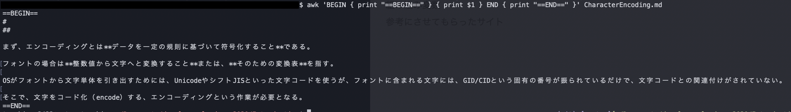
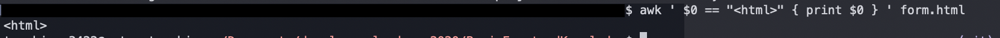
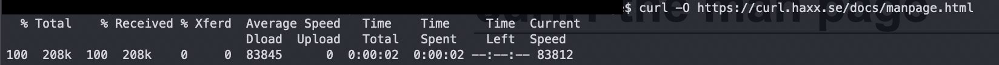
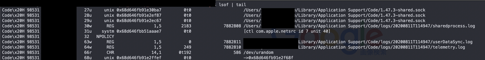

# Basic Terminal Commands
## grep
### grep とは？
grepはファイルの中で指定した文字列が含まれている行を表示するコマンド。
検索対象は複数ファイルやディレクトリからもできる。

ファイルを指定しなかった場合は、標準入力から読み込みまれる。
パイプと組み合わせて、他のコマンドの出力結果から必要な箇所だけを絞り込んで表示する際によく使われる。
### grepの書式
```
grep [オプション] 検索パターン ファイル

コマンド | grep [オプション] 検索パターン
```

### grepを使ってみた
OS.mdでosが含まれる行を表示してみる。

ちゃんとOSを拾って表示してくれた。

## awk
### awkとは？
テキストファイルの加工・抽出等の処理が得意な言語。
なので正確にはコマンドではなくプログラミング言語らしい。

### awkの書式
```
awk 'パターン { アクション }' [ 入力ファイルのパス ]
```
パターンは以下の４つで表現できる。
1. 正規表現
2. BEGIN
3. END
4. 評価式

正規表現の書き方
```
awk '/正規表現/ { アクション }'
```

BEGIN,ENDの書き方
```
awk 'BEGIN { 最初の行を読み込む前の処理 } { メイン処理 } END { 最後の行を読み込んだ後の処理 }'
```

評価式の書き方
```
awk '評価式 { アクション }'
```

アクション処理内部ではif文やfor文などの制御文も使用可能。
また、指定したパターンが真の時のみアクションが実行される。
### awkを使ってみた
正規表現のパターンを使ってみる。


BEGINとENDのパターンを使ってみる。


評価式のパターンを使ってみる。


使ってみた感じは簡単な抽出はgrepの方が楽だけど、抽出するときに分岐があったり、条件つきの場合はawkの方が向いていると思った。

## sed
### sedとは？
文字列の置換、挿入、削除ができるコマンド。
標準出力。

### sedの書式
```
sed [オプション] スクリプトコマンド 入力ファイル
```

-iオプションをつけると直接編集して上書きできる。

### sedを使ってみた
test.txtの各行で、eeeにマッチする全ての箇所をEEEに置換してみる。


## lsof
### lsofとは？
**プロセスが開いているファイル**を表示するコマンド。

UNIX／Linuxではネットワークソケットやデバイスドライバー、プロセス情報なども「ファイル」として扱っている。
そのため、開かれているファイルを調べることで、待機ポートやネットワークのマッピング情報などを把握できる。

### lsofの書式
```
lsof [オプション] [パス名]
```

出力項目の意味は以下の通り

|項目|意味|
|--|--|
|COMMAND|実行中のプログラム|
|PID|プロセス番号|
|USER|実行ユーザー|
|FD|ファイルディスクリプター|
|TYPE|ファイル種別|
|DEVICE|デバイス番号|
|SIZE/OFF|ファイルサイズ|
|NODE|プロトコル|
|NAME|ファイルまたはポート|

ファイルディスクリプターについては👇

[Qiita - ファイルディスクリプタについて理解する](https://qiita.com/toshihirock/items/78286fccf07dbe6df38f)

### lsofを使ってみた
とりあえず、全てのプロセスを実行してみる。ついでにawkでプロセスの数も調べてみる。


実行してビビったが、プロセスが1万個超えてた。
並行処理のことを考えるとどんなスピードでタスク入れ替えてるのか想像するだけで恐ろしい。
コンピュータってすごい。


次にポート番号80を使用しているプロセスを調べてみた。


ESTABLISHEDなので接続が確立されている状態だが、この後このサイトが開かれることはなかった。重すぎる。。。

## curl
### curlとは？
さまざまなプロトコルに対応したデータを転送するためのコマンド。
APIを叩くためによく使われる。
でもAPIを叩くためだけの存在じゃない。

### curlの書式
```
curl -O [オプション] URL

curl [オプション] URL > 保存ファイル名
```

### curlを使ってみた
URLを指定して、取得→ファイルに出力してみる。
「-O」オプションの場合、転送元のファイル名がそのまま使われるらしい。
今回は[curlのマニュアル](https://curl.haxx.se/docs/manpage.html)をダウンロードしてみる。



取得したファイル👉[manpage.html](/manpage.html)

次にHTTPヘッダを出力させてみる。「-I」オプションで HTTP ヘッダのみを取得できる。

```
curl -I https://curl.haxx.se/docs/manpage.html
👇                                                                                         
HTTP/2 200 
server: Apache
x-frame-options: SAMEORIGIN
last-modified: Sun, 23 Aug 2020 00:45:55 GMT
etag: "34138-5ad80caeb840c"
cache-control: max-age=60
expires: Sun, 23 Aug 2020 16:22:11 GMT
x-content-type-options: nosniff
content-security-policy: default-src 'self' www.fastly-insights.com; style-src 'unsafe-inline' 'self'
strict-transport-security: max-age=31536000; includeSubDomains;
content-type: text/html
via: 1.1 varnish
accept-ranges: bytes
date: Mon, 24 Aug 2020 06:16:10 GMT
via: 1.1 varnish
age: 0
x-served-by: cache-bma1641-BMA, cache-itm18821-ITM
x-cache: HIT, MISS
x-cache-hits: 1, 0
x-timer: S1598249769.959769,VS0,VE1142
vary: Accept-Encoding
content-length: 213304
```

## wget
### wgetとは？
指定したURLのファイルをダウンロードできるコマンド。

対応するプロトコルはHTTP、HTTPS、FTPのみ。

curlとの違いは再起的にダウンロードできる点。

再起的について👉[コマンドオプションの再帰的ってなに？](https://geek-memo.com/recursive/)

### wgetの書式
```
wget [オプション] URL

wget -r [オプション] URL
```
-rをつけると再帰ダウンロードを行う。

### wgetを使ってみた
`http://www.example.comのindex.html`を取得してくる。

-lは指定した回数分リンクをたどる。今回は1回。

-Hは外部のサーバ（ドメイン）も含めてファイルをダウンロードしてくる。

```
$ wget -l 1 -H -r http://www.example.com     
👇                                                                                   
--2020-08-24 16:00:24--  http://www.example.com/
www.example.com (www.example.com) をDNSに問いあわせています... 93.184.216.34
www.example.com (www.example.com)|93.184.216.34|:80 に接続しています... 接続しました。
HTTP による接続要求を送信しました、応答を待っています... 200 OK
長さ: 1256 (1.2K) [text/html]
`www.example.com/index.html' に保存中

www.example.com/index.html                                                100%[=====================================================================================================================================================================================>]   1.23K  --.-KB/s 時間 0s       

2020-08-24 16:00:24 (63.0 MB/s) - `www.example.com/index.html' へ保存完了 [1256/1256]

robots.txtを読み込んでいます、エラーは無視してください。
--2020-08-24 16:00:24--  https://www.iana.org/robots.txt
www.iana.org (www.iana.org) をDNSに問いあわせています... 192.0.32.8
www.iana.org (www.iana.org)|192.0.32.8|:443 に接続しています... 接続しました。
HTTP による接続要求を送信しました、応答を待っています... 200 OK
長さ: 24 [text/plain]
`www.iana.org/robots.txt' に保存中

www.iana.org/robots.txt                                                   100%[=====================================================================================================================================================================================>]      24  --.-KB/s 時間 0s       

2020-08-24 16:00:25 (1.14 MB/s) - `www.iana.org/robots.txt' へ保存完了 [24/24]

--2020-08-24 16:00:25--  https://www.iana.org/domains/example
www.iana.org:443 への接続を再利用します。
HTTP による接続要求を送信しました、応答を待っています... 301 Moved Permanently
場所: https://www.iana.org/domains/reserved [続く]
--2020-08-24 16:00:25--  https://www.iana.org/domains/reserved
www.iana.org:443 への接続を再利用します。
HTTP による接続要求を送信しました、応答を待っています... 200 OK
長さ: 10336 (10K) [text/html]
`www.iana.org/domains/example' に保存中

www.iana.org/domains/example                                              100%[=====================================================================================================================================================================================>]  10.09K  --.-KB/s 時間 0s       

2020-08-24 16:00:25 (65.3 MB/s) - `www.iana.org/domains/example' へ保存完了 [10336/10336]

終了しました --2020-08-24 16:00:25--
経過時間: 1.3s
ダウンロード完了: 3 ファイル、11K バイトを 0s で取得 (58.3 MB/s)
```
実行結果👉[www.example.com/index.html](www.example.com/index.html)

## tail
### tailとは？
テキストファイルまたはパイプでのテキスト入力の最後のn行を抜き出すコマンド。
行単位ではなくバイト単位での指定も可能。
デフォルトでは最後の10行を抜き出す。

### tailの書式
```
tail [オプション] ファイル名

コマンド | tail [オプション]
```

### tailを使ってみた
lsofにパイプを通して、最後の１０行を出力してみる。



## head
### headとは？
tailとは逆で、先頭を抜き出すコマンド。
デフォルトだと10行出力する。

### headの書式
```
head [オプション] ファイル名

コマンド | head [オプション]
```

### headを使ってみた
今回はHTTPヘッダの先頭10行を出力してみる。

```
curl -I https://curl.haxx.se/docs/manpage.html | head
👇                                                                                   (git)
  % Total    % Received % Xferd  Average Speed   Time    Time     Time  Current
                                 Dload  Upload   Total   Spent    Left  Speed
  0  208k    0     0    0     0      0      0 --:--:--  0:00:02 --:--:--     0
HTTP/2 200 
server: Apache
x-frame-options: SAMEORIGIN
last-modified: Sun, 23 Aug 2020 00:45:55 GMT
etag: "34138-5ad80caeb840c"
cache-control: max-age=60
expires: Sun, 23 Aug 2020 16:22:11 GMT
x-content-type-options: nosniff
content-security-policy: default-src 'self' www.fastly-insights.com; style-src 'unsafe-inline' 'self'
strict-transport-security: max-age=31536000; includeSubDomains;
```

## less
### lessとは？
「less」は、テキストファイルを1画面ずつ表示するコマンド。

中身みるならvimでもいいじゃん、って思うかもしれないが、なんかの間違いでファイルの中身を変更してしまう可能性があるので、閲覧するだけなら使わないのがベター。

### lessの書式
```
less [オプション] ファイル名

コマンド | less [オプション]
```

1行ずつ進めたい時：enter

上下スクロール：矢印キー

終了：［Q］または［q］キー

### lessを使ってみた
lessを使って、フェンリル株式会社のHPのコードを覗いてみる。ついでに何行書かれているかみてみることにした。


コマンド👉`curl https://www.fenrir-inc.com/jp/ | less -N `

結果👇


478行コードがあった。


## find
### findとは？
### findの書式
### findを使ってみた

<!-- ## ssh
### とは？
### の書式
### を使ってみた -->

<!-- ## kill
### とは？
### の書式
### を使ってみた -->

## 参考文献
エンジニアの入り口 - grepコマンドの詳細まとめました【Linuxコマンド集】（最終閲覧日：2020年8月19日）
https://eng-entrance.com/linux-command-grep#grepand

Qiita - [初心者向け]Awkの使い方（最終閲覧日：2020年8月21日）
https://qiita.com/tofu511/items/3ecf9c5361d08b5c6eae#%E7%B5%84%E3%81%BF%E8%BE%BC%E3%81%BF%E5%A4%89%E6%95%B0

わくわくBank - sedコマンド(文字列置換)の使い方（最終閲覧日：2020年8月24日）
https://www.wakuwakubank.com/posts/338-linux-sed/

ITmedia Inc. - このポートで実行中のプロセスはどれ？ lsofコマンドの使い方（最終閲覧日：2020年8月24日）
https://www.atmarkit.co.jp/ait/articles/1510/05/news014.html

ITmedia Inc. - 【 curl 】コマンド――さまざまなプロトコルでファイルをダウンロード（転送）する（最終閲覧日：2020年8月24日）
https://www.atmarkit.co.jp/ait/articles/1606/22/news030.html#opt

Qiita - curl コマンド 使い方メモ（最終閲覧日：2020年8月24日）
https://qiita.com/yasuhiroki/items/a569d3371a66e365316f#url%E3%82%A8%E3%83%B3%E3%82%B3%E3%83%BC%E3%83%89%E3%81%99%E3%82%8B%E3%81%A0%E3%81%91

ITmedia Inc. - 【 wget 】コマンド――URLを指定してファイルをダウンロードする（最終閲覧日：2020年8月24日）
https://www.atmarkit.co.jp/ait/articles/1606/20/news024.html

ITmedia Inc. - 【 head 】コマンド／【 tail 】コマンド――長いメッセージやテキストファイルの先頭だけ／末尾だけを表示する（最終閲覧日：2020年8月24日）
https://www.atmarkit.co.jp/ait/articles/1603/07/news023.html

Qiita - エンジニアなら知っておきたい lessコマンドtips 11選（最終閲覧日：2020年8月25日）
https://qiita.com/ine1127/items/64b5b6cf52471c3fe59c
