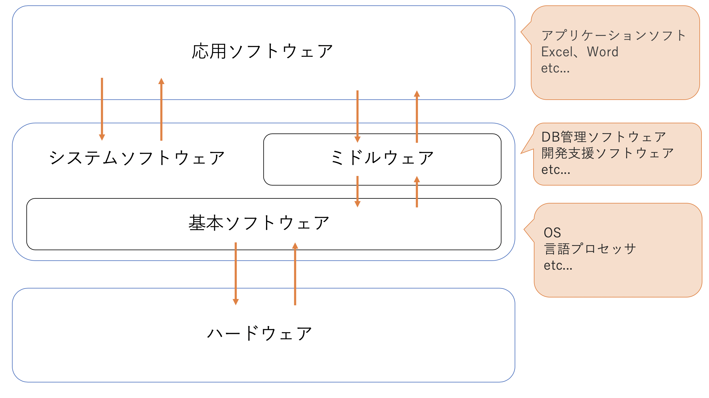

# How Oss work General - 一般的なOSの仕組み
## OSとは何か？
OSとは**Operation System**の略ことでコンピュータの基本操作を実現するための基本ソフトウェアである。
代表的なOSには以下のようなものがある。

|OS名|特徴|
|--|--|
|Windows|現在最も広く使われているMicrosft社製のOS。PC市場の９割を占めるほど。|
|Mac OS|Apple社製のOSでGUIを実装したOSの元祖。|
|MS-DOS|Windowsの普及以前に広く使われていたMicrosoft社製のOS。CUIで実装されているOS。|
|UNIX|サーバーに使われることの多いOS。1969年にAT＆T社が開発した。|
|LINUX|UNIX互換のOS。オープンソースのソフトウェアで、無償で利用できる。|
|Ubuntu|LINUXをベースに開発されたOSで、2004年より無償で提供されている。ネットブックの一部機種に搭載されていたことで広く普及が進み、55言語以上に対応し、世界中に1000万人以上のユーザーがいる。|

<!-- OSの歴史とか書く？ -->
## OSとはなんのためにあるか？
OSは基本ソフトウェアとして、応用ソフトウェアや、ミドルウェア、ハードウェアなどの仲介、制御を行っている。

## OSを構成する要素
### ブートローダ
コンピュータを起動時に呼び出されて、OSを起動させるプログラムのこと。
ブートローダは「ブート」と「ローダ」の言葉通り、二つの動作がある。

第一段階はハードウェアの動作でコンピュータの電源を投入した際に起動するBIOSである。
BIOSとは主にハードウェアを制御するプログラムで、これの働きでHDDやキーボードなどのハードウェアが動けるようになる。
BIOSはこの時にOSを起動させるためのブートローダも起動するように命令を出している。

第二段階はソフトウェアの動作の動作で、BIOSに起こされたブートローダがOSを起動してくれる。

流れとしては以下のような感じ。

コンピュータの電源ON

↓

BIOS起動

↓

ブートローダ起動

↓

OS起動

### カーネル
OSの中核部分に位置するソフトウェアで、デーモンやシェルなどのソフトウェアの力を借りながら、ハードウェアとソフトウェアの仲介をしている。

メモリやCPUなどのハードウェアが効率良く動けるようにジョブ管理などもしている。

### デーモン
UNIX系OSで常駐してメモリ上で役割が来た時に機能するプログラムのこと。
「httpd」や「ftpd」などの語尾に「D」が付いているファイルがデーモンである。

### シェル
ユーザーが入力したことをカーネルに分かるように伝える仲介役のプログラムのこと。

一般的にシェルの操作はターミナルから行われる。
ユーザーはターミナルを通じて、コマンドをシェルに伝え、シェルを操作することができる。
逆にシェルはターミナルを通じてユーザーにコマンドの結果を伝えることができる。

なので、ターミナルはシェルを操作するための入出力の画面だけを提供するソフトウェアである。

代表的なシェルを以下にまとめる。

|シェル名|特徴|
|--|--|
|sh|古くからあるシェルで、多くのOSで利用できる。長い歴史から標準シェルとしてシェルスクリプトの作成に利用されているが、古いので機能が少なく、対話的に使う場面では不便。|
|bash|shの拡張版。shと後方互換性を持つため、shを置き換えることが可能。|
|zsh|他のシェルの機能をいいとこ取りし、さらに独自の拡張機能を実装したシェル。多機能なので使いこなすのが難しいが、慣れれば色々な作業が効率的に行える。|

### デスクトップマネージャ
画面の描画を管理するためのプログラムのこと。
これのおかげで画面表示でのPC操作環境が快適に行える。
デスクトップ環境とも呼ばれる。

### アプリケーション
PC操作を快適に行うためにプログラムされたソフトウェアのこと。
例えばファイル管理などがある。

## 参考文献
Geekly - OSの機能と構成とは？？初心者にも分かりやすく解説！（最終閲覧日：2020年8月7日）

https://www.geekly.co.jp/column/cat-technology/1910_023/
