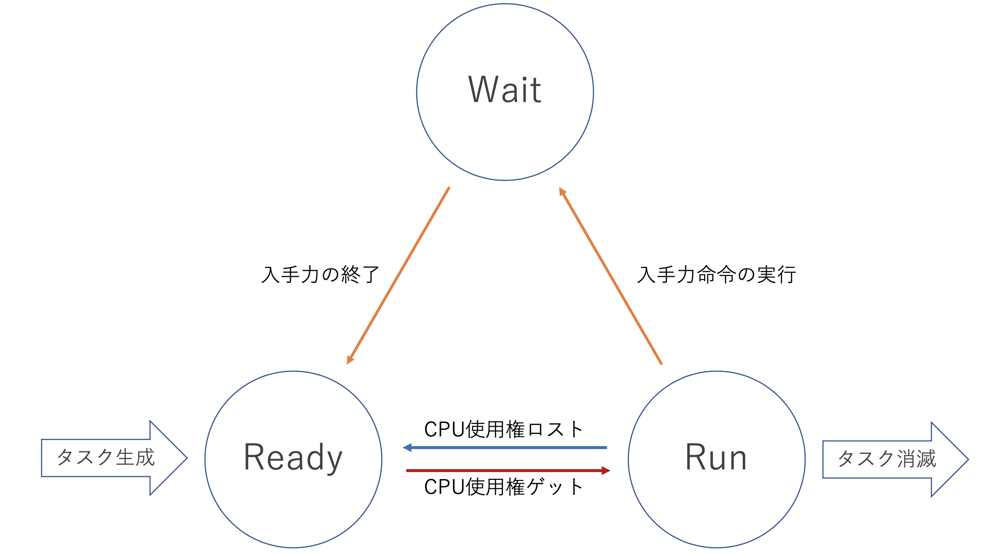

# Process Management - プロセスマネジメント
## プロセス、プロセスマネジメントとは何か？
### プロセスとは？
OSが実行中のプログラムのことを**プロセス**という。

もう少し丁寧に言うと、プロセスはコンピュータにさせたい仕事(ジョブ)をめっちゃ細かく分解して、OSが実際に実行しているプログラムのこと。

例えば、ユーザーが「会社の従業員全員の給与明細を作成するプログラム」を実行したとする。
このプログラムは以下のようにステップを分解できる。

- 労働時間の収集
- 給与計算
- 明細票の印刷

コンピュータはこのように一連のプログラムをCPUの実行単位の大きさに分解する。
この分解された仕事の単位を**タスク**と呼ぶ。

そして、OSによって実行中のタスクが**プロセス**である。

ここで出た用語をまとめると以下のような感じ

- ジョブ： 人間がOSに与える仕事単位
- タスク： OSの下での内部処理の単位
- プロセス： OSから許可を受けて実行中のタスク

※1つのジョブが複数のタスクに分割されることもある

### プロセスマネジメントとは？
CPUを効率よく使うために、プロセスを管理する機能のこと。具体的にはプロセスの生成・実行・消滅などの管理をしている。

これらの管理を効率よく行うためにプロセスには以下の３つの状態がある。

- 実行可能状態(ready) : 実行準備ができてCPUの使用権を待っている状態
- 実行状態(run) : CPUの使用権が与えれられて実行中の状態
- 待機状態(wait) : 主に入出力処理中で終了を待っている状態

この３つの状態は以下の図のように遷移している。

### プロセスマネジメントは何の為にあるの？
プロセスマネジメントをすることで以下のことを実現したいから。

- トータルのスループットの向上
- 平均応答時間の短縮
- プロセス間の公平なCPUなどの割り当て

<!-- これらを実現するための技術にマルチプログラミングと言うものがある。

### マルチプログラミングとは？

## 実際にプロセスを覗いてみよう -->

## 参考文献
ラクス エンジニアブログ - 【Linux】今振り返りたい、プロセスって何？（最終閲覧日：2020年8月10日）

https://tech-blog.rakus.co.jp/entry/20200402/linux
