# Basic Usage of Git and Github

## バージョン管理について

### バージョン管理とは

プロジェクトの中で更新されていく様々な成果物の変更の履歴を成果物そのものも含めて記録するシステムをバージョン管理と言う。

バージョン管理システムには主に集中管理方式と分散管理方式の２つがある。

集中管理方式とはファイルのバージョン管理を専用のサーバ（リポジトリ）で一元管理する方式のこと。
サーバ上にリポジトリと呼ばれるバージョン管理専用のフォルダを作成し、ユーザーの PC にクライアントソフトウェアを導入する。
クライアント PC からユーザーがそれぞれがサーバに接続するとファイルを利用できる。
集中管理方式では、コミット（チェックイン）するごとにバージョンが加算され、リポジトリ内のバージョンが自動的にひとつずつ増えていく。
ここでいう「コミット」（バージョン管理ソフトによっては「チェックイン」ともいう）とは、ファイルをアップロードすること。
逆に、サーバからファイルをダウンロードすることを「チェックアウト」と呼ぶ。

集中管理方式ではサーバ上でファイル情報を一括管理するため、サーバにつながっていない状態ではファイルの変更情報を記録できない。
集中管理方式の例には「CVS」や「Subversion（SVN）」などがある。

ユーザーがそれぞれ PC 内にリポジトリのコピーを持つ方式を分散管理方式と呼ぶ。
ファイルが更新されると、それぞれの PC 内にあるローカルリポジトリでファイルの変更を記録する。
ある程度作業が進んだら、サーバ上のリモートリポジトリに変更内容を反映させる。

ユーザーがそれぞれ自分の PC 内にリポジトリを保持しているため、ネットワークにつながらずサーバにアクセスできなくても作業ができるのが特徴。
分散管理方式は複数人が分散してシステムを開発するという近年のニーズとマッチしている。
分散管理方式には「Git」や「Mercurial」などがある。

## ブランチとは

- ブランチとは履歴の流れを分岐して記録していくためのもの。
- 分岐したブランチは他のブランチの影響を受けないため、複数の変更を同時にできるメリットがある。
- ブランチの実態はコミットを指す軽量なポインタである。
  - これはブランチが特定のコミット ID を指していることを意味する。
  - コミット ID とはコミットで生成されるコミットオブジェクトを区別するためのもので、40 文字の 16 進数で表現される。
- ブランチが履歴を記録できるのはコミットがコミットを指すことでそれぞれを結び付けている。
  - コミットオブジェクトの parent に一つ前のコミット ID が記録されていて、これがコミット同士を結び付けている。
  - parent は git cat-file -p [コミット ID]で見ることができる。

## ローカルとリモート

### ローカルとリモートの意味

ローカルとは IT 用語では、ネットワークに接続していない状態で直接操作できる機器や状態を指す事が多い。

一方、リモートはネットワークに接続し、遠隔操作による作業環境を指すことが多い。

### リポジトリとは？

ファイルやディレクトリの履歴を管理する場所のこと。
Git ではローカルリポジトリとリモートリポジトリの２つでプロジェクトを管理することが多い。

### ローカルリポジトリ

ローカルリポジトリとはローカル環境の指定されたフォルダ内のファイルをバージョン管理するためのレポジトリのこと。

### リモートリポジトリ

リモートリポジトリはネット上にファイルをアップロードした状態でファイル管理するためのもの。
リモートリポジトリを管理するためのサービスとして、Bitbucket や Github などがある。

### リモートリポジトリの作り方

今回は様々な git コマンドを練習するためにまずは専用のリポジトリを作成する。
作り方は GitHub にアクセスして、左にある「New」ボタンをクリックする。

そうすると以下のようなページに飛ぶので、必要項目を記入して「Create repository」ボタンをクリックすればリポジトリが作成できる。

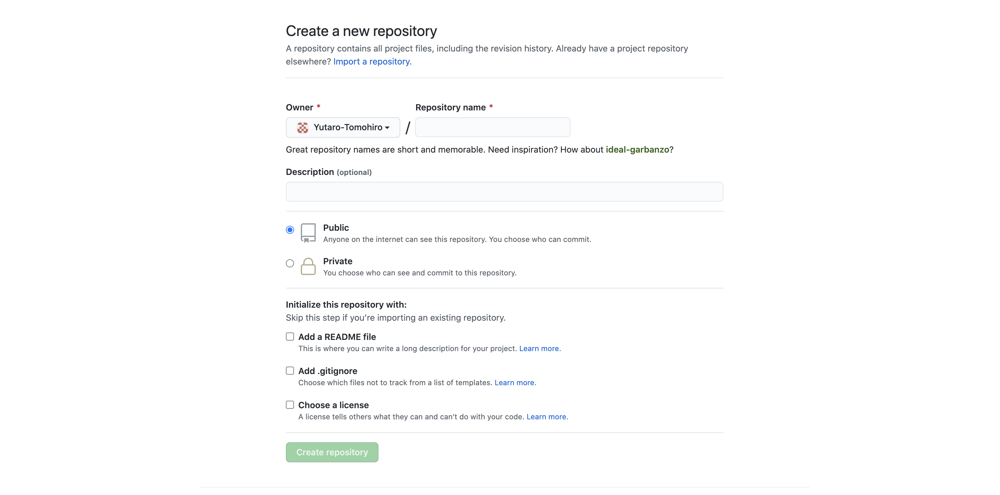

完成したリポジトリは[こちら](https://github.com/Yutaro-Tomohiro/git_practice)。

## clone

既存の Git リポジトリを別のサーバーからクローンするコマンド。
プロジェクトのスタートや途中から開発に加わるときに使う。

```
git clone [リポジトリ名]
```

リモートリポジトリの作り方で作ったリポジトリをクローンする。
リポジトリのあるページの右上に「code」というボタンをクリックして、「Clone」の下にある URL をコピーする。

あとは、自分がダウンロードしてきたいディレクトリまで移動して、git clone コマンドを打つだけ。

```
git clone https://github.com/Yutaro-Tomohiro/git_practice.git
```

こんな感じのテキストが帰ってきたらクローンが成功している。

```
Cloning into 'git_practice'...
remote: Enumerating objects: 3, done.
remote: Counting objects: 100% (3/3), done.
remote: Total 3 (delta 0), reused 0 (delta 0), pack-reused 0
Unpacking objects: 100% (3/3), done.
```

## add

ファイルをステージするためのコマンド。

```
// 任意のファイルの変更をステージする
$ git add <file>

// 現在のディレクトリのファイルすべてをステージする
$ git add .
```

git_practice リポジトリの README.md を編集する。

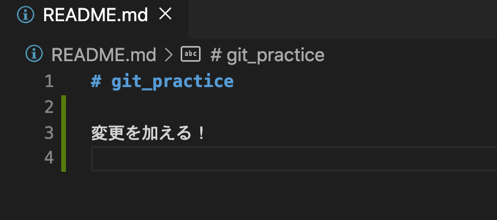

`git status`で変更を確認する。

```
$ git status                                                                              (git)-[main][~/workspace/git_practice]
On branch main
Your branch is up to date with 'origin/main'.

Changes not staged for commit:
  (use "git add <file>..." to update what will be committed)
  (use "git restore <file>..." to discard changes in working directory)
        modified:   README.md

no changes added to commit (use "git add" and/or "git commit -a")
```

赤字で`modified: <ファイル名>`となっているファイルは変更があったことを表しており、今回は README.md に変更があった事が分かる。

変更があったファイルをステージングするために add コマンドを使う。

```
git add README.md
```

もう一度`git status`で変更を確認する。

```
$ git status                                                                              (git)-[main][~/workspace/git_practice]
On branch main
Your branch is up to date with 'origin/main'.

Changes to be committed:
  (use "git restore --staged <file>..." to unstage)
        modified:   README.md
```

先ほど赤字で表示されていたファイルが緑色になっていればステージングが成功している。

## commit

`git add`でステージングされたファイルをリモートリポジトリに記録するためのコマンド。

コミットする時に「コミットメッセージ」をつける事で変更の作業内容を記録する事ができる。
適切なコミットメッセージをつけることによって他人がブランチを遡って見る時に把握しやすくなるので、適切なコミットメッセージをかけることは重要。

`Commit`は 2 通りのやり方がある。

```
//1行の場合
git commit -m "コミットメッセージ"

//複数行で書きたい時
git commit
```

先ほどステージングした README.md をコミットする。

```
$ git commit -m"README.mdに記述を追加"
```

こんな感じのメッセージが帰ってくれば OK。

```
[main 0e309b4] README.mdに記述を追加
 1 file changed, 3 insertions(+), 1 deletion(-)
```

## push

ローカルリポジトリの変更履歴をリモートリポジトリに反映するためのコマンド。
リモートにある同名ブランチに push するには、

```
git push origin master
```

とすれば良い。

README.md の変更をリモートリポジトリに反映させたいので上記のコマンドを打つと、

```
Enumerating objects: 5, done.
Counting objects: 100% (5/5), done.
Writing objects: 100% (3/3), 314 bytes | 314.00 KiB/s, done.
Total 3 (delta 0), reused 0 (delta 0)
To https://github.com/Yutaro-Tomohiro/git_practice.git
   22aa005..0e309b4  main -> main
```

と帰ってきたので、GitHub のリポジトリページへ行って、変更が反映されているか確認する。

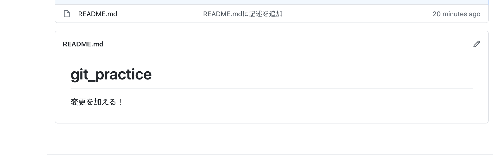

うまくいっている事が確認できた。

## checkout

`checkout`コマンドは以下の２つの役割を持つ。

- 作業ブランチを切り替える
- 指定したコミットの状態を現在の作業ツリーに展開する

作業ブランチを切り替えるには`checkout`コマンドを以下のように使う。

```
git checkout [ブランチ名]
```

また、新しいブランチを切ってそのままそのブランチに切り替える場合は`-b`オプションを付ければいい。

git_practice の今の作業ブランチは`master`なので新しく`develop`を切って、そちらに切り替える。

```
git checkout -b develop
```

`git status`で確認すると

```
On branch develop
nothing to commit, working tree clean
```

となっているので、develop ブランチに切り替わっている事が確認できる。

develop ブランチに切り替わったついでに README.md に変更を加えて、リモートブランチ反映させる。

変更内容 ↓

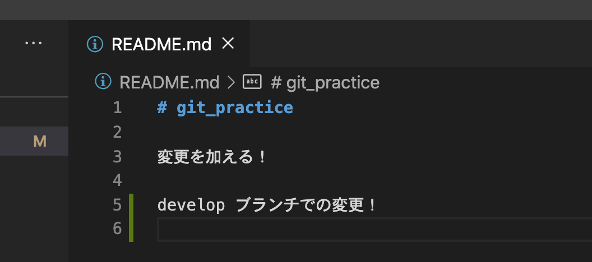

で add と commit、push までしておく。

github に develop ブランチとして変更が共有された事が確認できる ↓

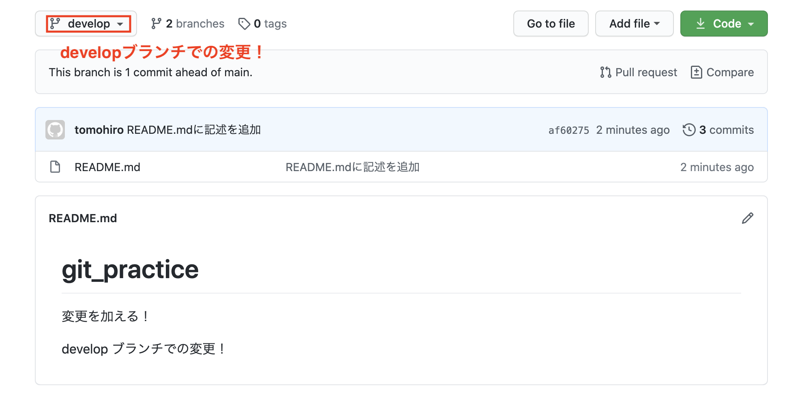

master ブランチでは変更されていない ↓

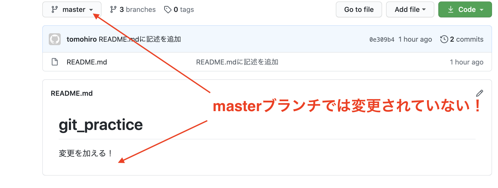

## PullRequest

特定のブランチの変更を別のブランチに取り込むこと。

先ほど作った develop ブランチを master に取り込んで行く。
実際のプロダクトでは PullRequest という機能を使って、マージする前に他の方からレビューをしてもらうのが一般的。

プルリクエストするには取り込みたい変更側のブランチのページから`Pull requests`というタブをクリックする。

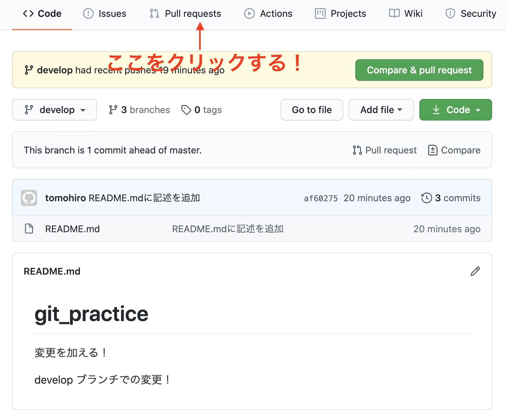

飛んだ先のページで左上の方にある`New pull request`を押すと以下のようなページに飛ぶので`compare: develop`に変更して`Create pull request`をクリックする。

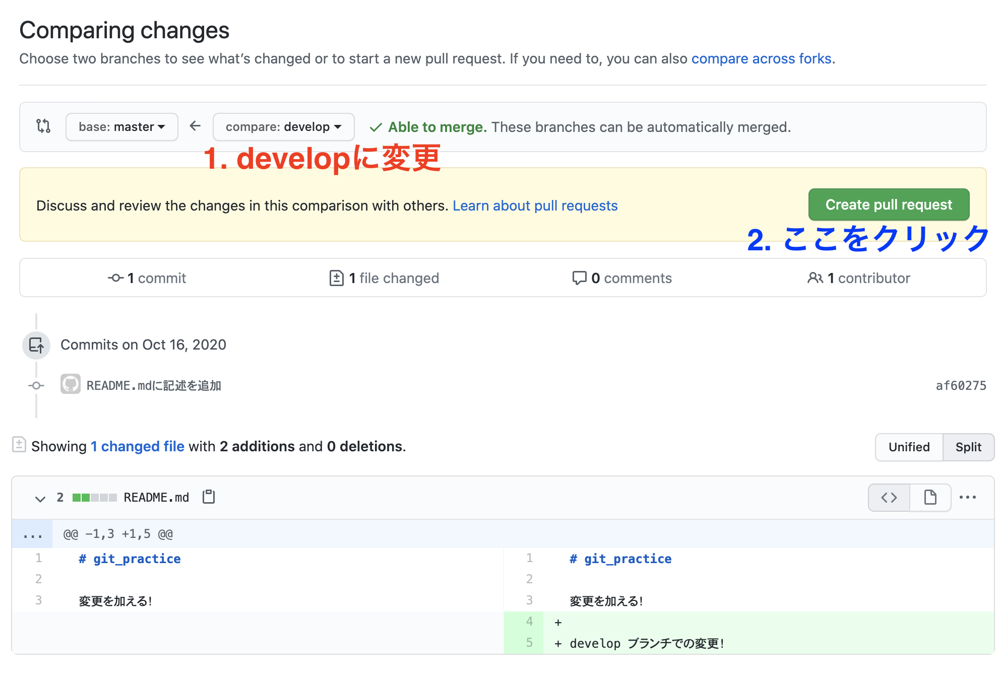

`Title`を入れて`Create pull request`をクリックすれば、PullRequest 完成。

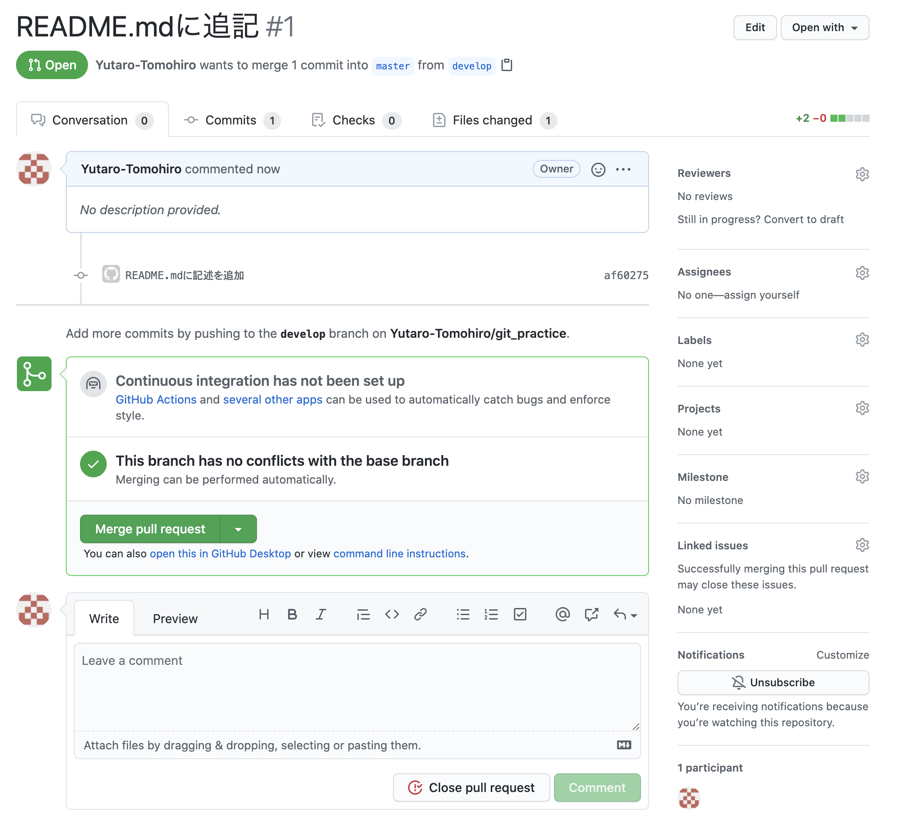

マージは上画像の`Merge pull request`を押すだけで良い。
リポジトリの TOP ページに戻ると、マージされて master ブランチに変更内容が反映されているのが確認できる。

## fetch

リモートレポジトリから、ブランチとタグの情報をローカルレポジトリに取得するためのコマンド。

`git fetch`でリモートからブランチとそのコミット履歴を取得する時、リモートブランチは「リモート追跡ブランチ」と呼ばれるブランチとしてローカルに反映される。

`git fetch`の主な使い方は以下の通り 👇

```
// originにあるのすべてのブランチを取得する
git fetch origin

//現在のブランチの上流ブランチからfetchする
git fetch

// リモートの master を、ローカルの origin/develop に反映する
git fetch origin master:master-tmp
```

`git fetch`を練習するためにリモートリポジトリから develop ブランチの`README.md`に変更を加える。

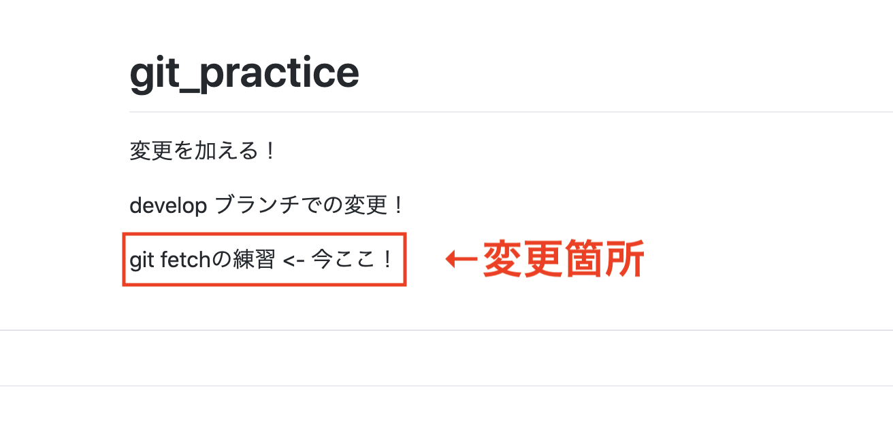

`git fetch origin develop`でリモートの develop ブランチの変更を fetch する。

```
 git fetch origin develop                                                                                                                   (git)-[develop][~/workspace/git_practice]
From https://github.com/Yutaro-Tomohiro/git_practice
 * branch            develop    -> FETCH_HEAD
```

## merge

現在のチェックアウトしているブランチに対して、別のコミットが持っている変更内容をマージ（統合）するためのコマンド。

今回は`git fetch`で取り込んだ develop のリモートブランチの変更をマージする。

```
git merge FETCH_HEAD                                                                                                                       (git)-[develop][~/workspace/git_practice]
Updating af60275..885999b
Fast-forward
 README.md | 2 ++
 1 file changed, 2 insertions(+)
```

`Fast-forward`とは、マージしたいブランチが現在のブランチよりも進んでいる時に、参照のみを移動して`merge`を完了させること。

## pull

リモートレポジトリの更新内容をローカルに取得し、現在のブランチに取り込むためのコマンド。
実際、`git pull`は`git fetch`と`git merge`を連続して実行する動作をしている。

```
// git pull origin masterとほぼ同義なコマンド
$ git fetch origin master
$ git merge FETCH_HEAD
```

ということで`git pull`の練習するためにリモートリポジトリから develop ブランチの`README.md`に変更を加える。

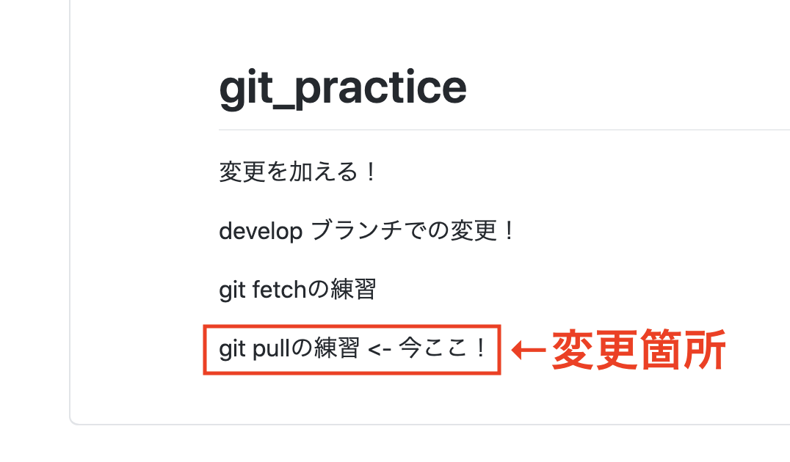

リモートリポジトリの develop ブランチの変更を`git pull`でローカルリポジトリの develop ブランチに取り込む。

```
git pull origin develop                                                                                                                    (git)-[develop][~/workspace/git_practice]
remote: Enumerating objects: 5, done.
remote: Counting objects: 100% (5/5), done.
remote: Compressing objects: 100% (2/2), done.
remote: Total 3 (delta 1), reused 0 (delta 0), pack-reused 0
Unpacking objects: 100% (3/3), done.
From https://github.com/Yutaro-Tomohiro/git_practice
 * branch            develop    -> FETCH_HEAD
   885999b..16d88be  develop    -> origin/develop
Updating 885999b..16d88be
Fast-forward
 README.md | 4 +++-
 1 file changed, 3 insertions(+), 1 deletion(-)
```

## rebase

異なるブランチの変更を統合するためのコマンド。
この説明だけだと、`merge`と同じだが、統合の方針に違いがある。

<!-- 例えば、`bugFixブランチ`なるものでバグ修正している間に`developブランチ`が先に進んでいたとする。
このまま、`develop`に`bugFix`をマージすると、コンフリクトしてしまう。

コンフリクトを`develop`で解決する -->

言葉だと難しいので、図で説明すると以下のような感じ。

例えば下図のようなブランチがあったとして、

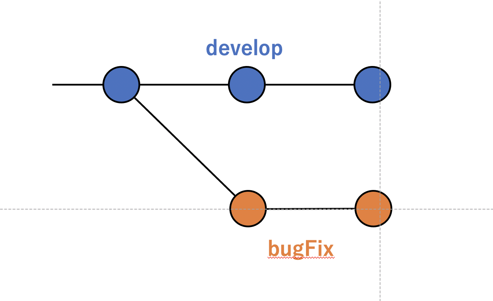

`mergeコマンド`を使うとこんな感じの履歴になる。

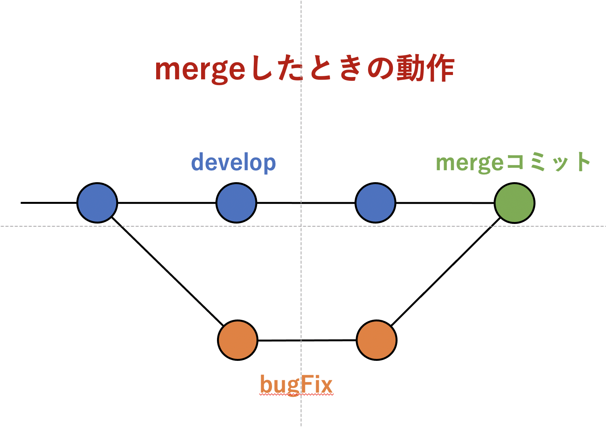

`rebaseコマンド`を使うとこんな感じになる。

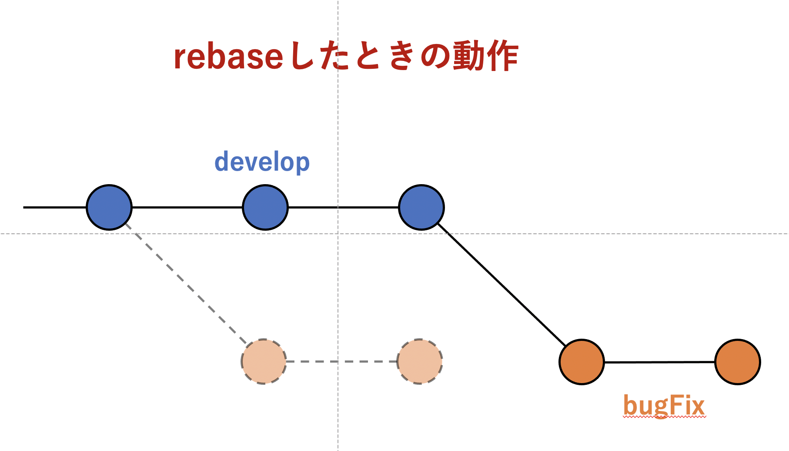

`rebase`のイメージは統合したいブランチをちぎって、統合元のブランチの最新コミットから引っ付ける感じ。

じゃあ、この統合の仕方が違うと何かいいことあるん？ってことだけど、`rebase`は**統合元のブランチ(ここでは develop ブランチ)の歴史をきれいに保てる**というメリットがある。

`merge`だと、develop と bugFix の両方とものコミットログが残ってしまう。

`rebase`だと`git merge --no-ff`を使うと、

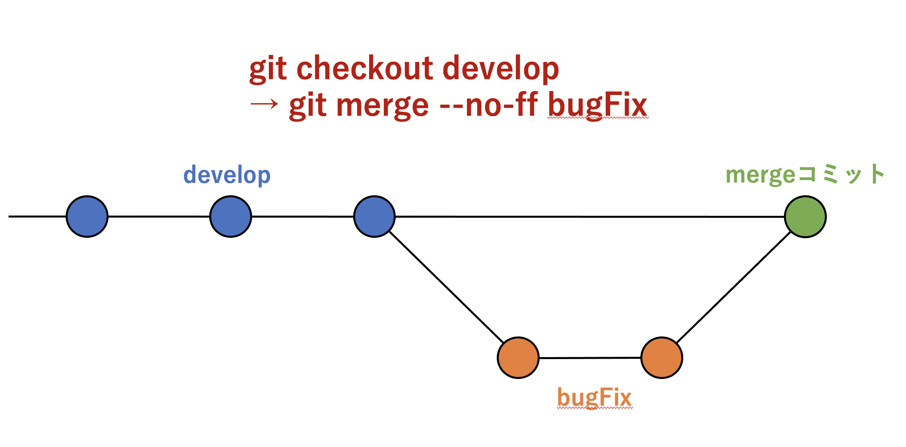

develop の歴史だけ見ると、直列の開発履歴で、変更コミットが機能ごと（bugFix ブランチ）に独立して見えるため、シンプルに見える。

実際に`rebase`を使ってみる。

`master`と`develop`のそれぞれのブランチに２個ずつコミットを積んでおく。

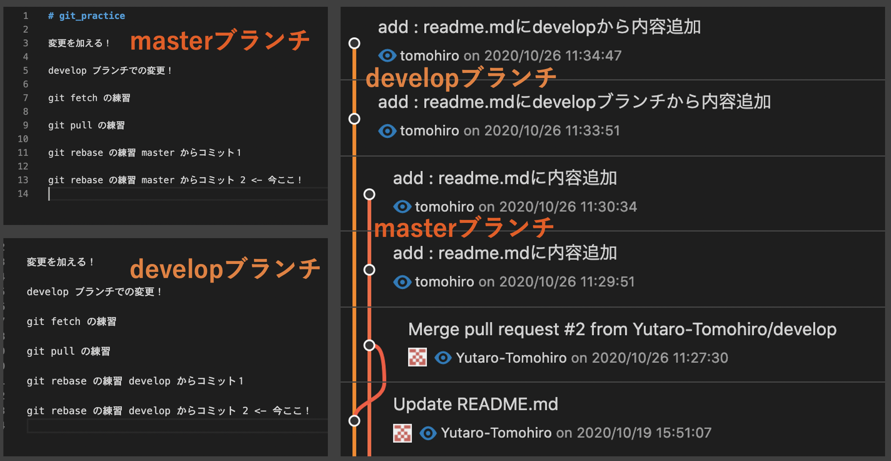

develop ブランチから`git rebase master`とコマンドを打つと以下のようなメッセージが帰ってくる。

```
First, rewinding head to replay your work on top of it...
Applying: add : readme.mdにdevelopブランチから内容追加
Using index info to reconstruct a base tree...
M       README.md
Falling back to patching base and 3-way merge...
Auto-merging README.md
CONFLICT (content): Merge conflict in README.md
error: Failed to merge in the changes.
Patch failed at 0001 add : readme.mdにdevelopブランチから内容追加
hint: Use 'git am --show-current-patch' to see the failed patch
Resolve all conflicts manually, mark them as resolved with
"git add/rm <conflicted_files>", then run "git rebase --continue".
You can instead skip this commit: run "git rebase --skip".
To abort and get back to the state before "git rebase", run "git rebase --abort".
```

長々としたメッセージだが、要は**README.md でコンフリクトが起きているよ。以下の３つのコマンドから解決方法を選んでね**ということで、3 つのコマンドの意味はこんな感じ。

| コマンド                | 意味                                                                                                              |
| ----------------------- | ----------------------------------------------------------------------------------------------------------------- |
| `git rebase --continue` | rebase を続行する。コンフリクトを解消した後に使う。                                                               |
| `git rebase --skip`     | rebase をスキップする。主にコンフリクト解消時に、1 つ前のコミットとの違いがなくなってしまった場合などに使用する。 |
| `git rebase --abort`    | rebase を中断する。ブランチの歴史は git rebase を実行する前に戻る。                                               |

今回は、rebase を続行するかつ、１つ前のコミットと違うので、コンフリクトを解消した後に`git rebase --continue`を実行する。

develop からブランチの状態をみるとこんな感じ。

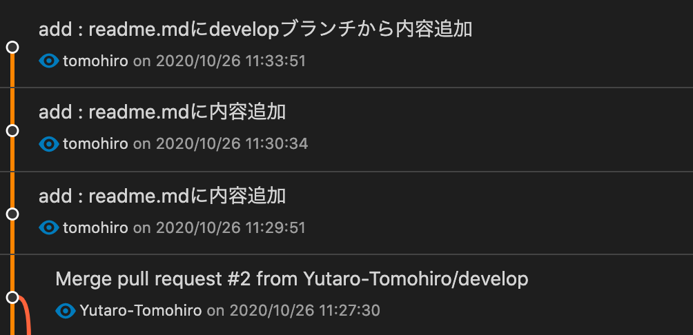

ちゃんとブランチが１本になっている。

しかし、master ブランチ戻って履歴を確認するとまだ develop の変更が反映されていないので、自身の最新のコミットで止まっている。

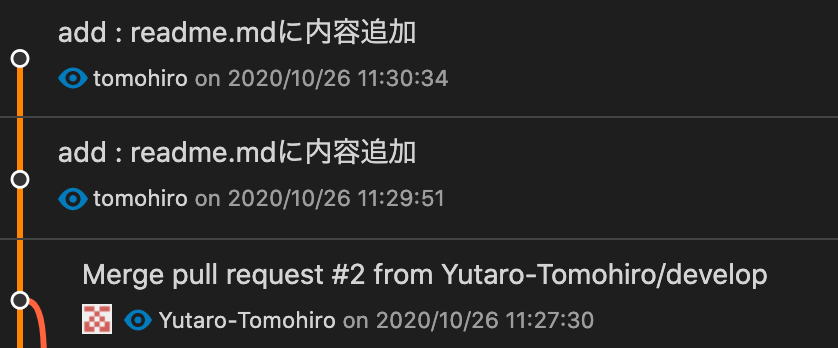

`git merge --no-ff develop`を実行すると、

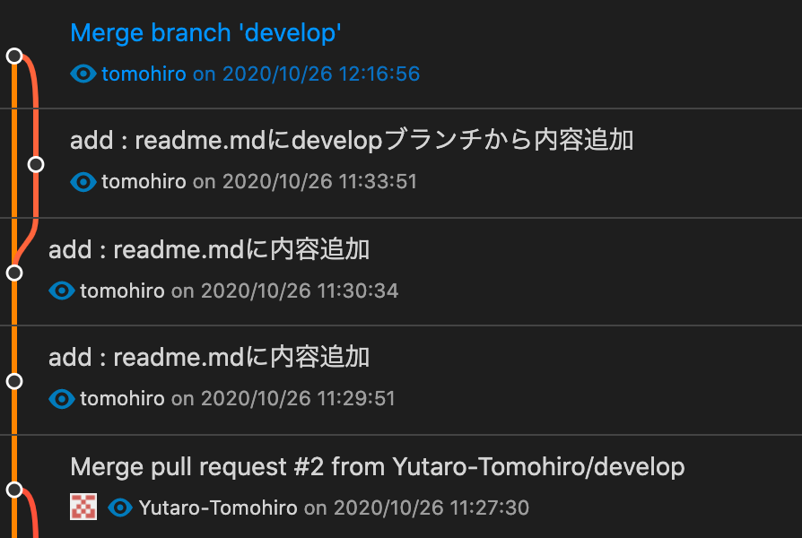

master の最新コミットから直列の開発履歴になっていて、bugFix の変更も独立して見えている。

## reset

HEAD の位置を変更するコマンド。
オプションによってインデックス、ワーキングツリーの内容も変更でき、コミット内容を取り消しするような振る舞いもできる。

`git reset`には大きく３つのオプションがある。
オプションは修正の及ぶ範囲で違う。

- --hard：「HEAD の位置・インデックス・ワーキングツリー」全て
- --mixed（or オプション無し）：「HEAD の位置・インデックス」
- --soft：「HEAD の位置」のみ

usecase ごとに説明する。

① 直前のコミットのみ取り消すとき : `git reset --soft HEAD^`

② 直前のコミットを丸ごと取り消したい : `git reset --hard HEAD^`

③ コミット後の変更を全部消したい : `git reset --hard HEAD`

④ add を取り消したい : `git reset (--mixed) HEAD`

⑤ 間違えて`git reset`したとき : `git reset --hard ORIG_HEAD`

実際に`git reset`を使ってみる。

README.md に変更を加える。

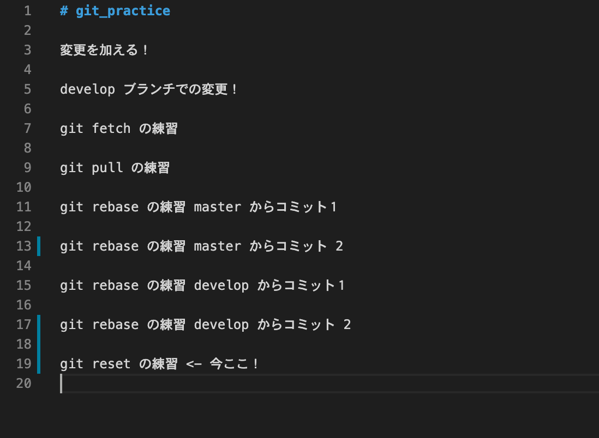

この内容をコミットして履歴を確認すると、

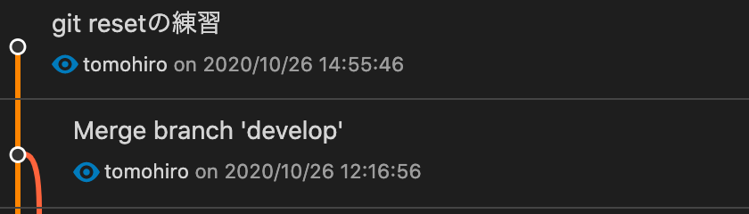

「git reset の練習」という新しいコミットメッセージが積まれている。

このコミットを取り下げたいので、`git reset --soft HEAD^`を実行して、履歴を確認すると

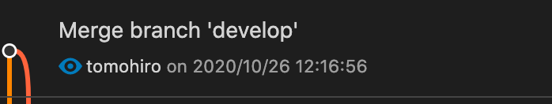

「git reset の練習」のコミットメッセージが消えている。
`git status`でも確認。

```
$ git status                                                                                                (git)-[master][~/workspace/git_practice]
On branch master
Your branch is ahead of 'origin/master' by 4 commits.
  (use "git push" to publish your local commits)

Changes to be committed:
  (use "git restore --staged <file>..." to unstage)
        modified:   README.md
```

ステージングの状態に戻ってる。

ステージング状態も取り下げるために`git reset --mixed HEAD`を実行する。

```
git status                                                                                                (git)-[master][~/workspace/git_practice]
On branch master
Your branch is ahead of 'origin/master' by 4 commits.
  (use "git push" to publish your local commits)

Changes not staged for commit:
  (use "git add <file>..." to update what will be committed)
  (use "git restore <file>..." to discard changes in working directory)
        modified:   README.md
```

ちゃんと、ステージングも取り下げれた。

ここまで来たので、ファイルの変更内容もなかったことにしたいので、`git reset --hard HEAD^`を実行する。

```
git status                                                                                                (git)-[master][~/workspace/git_practice]
On branch master
Your branch is ahead of 'origin/master' by 2 commits.
  (use "git push" to publish your local commits)

nothing to commit, working tree clean
```

ワーキングツリーも綺麗さっぱりになった。
ファイルの方を見ても先ほど書き込んだことはなくなっている。

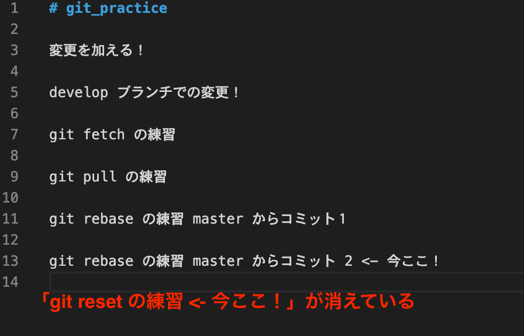

## projects

カンバン式のタスク管理を可能にする機能のこと。

リポジトリの TOP ページから Projects を押して、Cerate a project からプロジェクトを作成する。

## issue

## pages

## 補足

ワーキングツリー[working tree]：最新のファイルの状態

インデックス[index]（ステージ[stage]）：コミットするためのファイルの状態

## 参考文献

Git --eberything-is ー local | 3.1 Git のブランチ機能 - ブランチとは(最終閲覧日：2020 年 10 月 10 日）
https://git-scm.com/book/ja/v2/Git-%E3%81%AE%E3%83%96%E3%83%A9%E3%83%B3%E3%83%81%E6%A9%9F%E8%83%BD-%E3%83%96%E3%83%A9%E3%83%B3%E3%83%81%E3%81%A8%E3%81%AF

IT STAFFING   エンジニアスタイル | 第 2 話 ブランチとは？ポインタってどういう意味？作成・確認・切り替え方法【連載】マンガでわかる Git ～コマンド編～(最終閲覧日：2020 年 10 月 10 日）
https://www.r-staffing.co.jp/engineer/entry/20190719_1

こせきの技術日記 | Git の仕組み (1)(最終閲覧日：2020 年 10 月 10 日）
http://koseki.hatenablog.com/entry/2014/04/22/inside-git-1

WWW クリエイターズ | git push コマンドの使い方と、主要オプションまとめ(最終閲覧日：2020 年 10 月 16 日）
https://www-creators.com/archives/1472

Qiita | GitHub 実践ハンズオン(最終閲覧日：2020 年 10 月 16 日）
https://qiita.com/TakumaKurosawa/items/79a75026327d8deb9c04#4-commit%E3%81%97%E3%81%A6%E3%81%BF%E3%82%88%E3%81%86starstarstar

WWW クリエイターズ | よく分かる！git rebase と merge の違いと使い分け(最終閲覧日：2020 年 10 月 26 日）
https://www-creators.com/archives/1943
